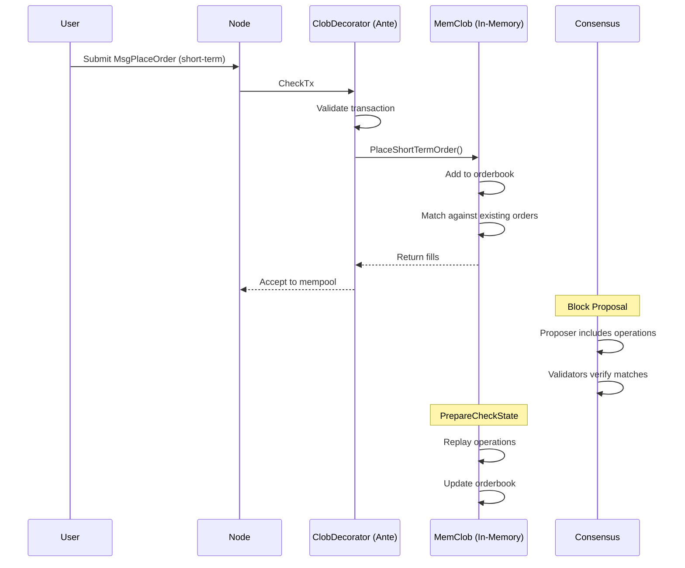
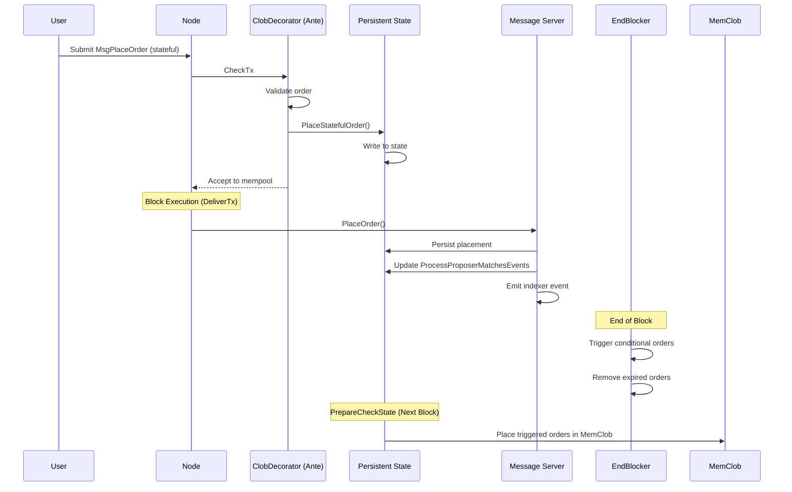

# dYdX Module Architecture - Complete Technical Flow

## Overview

This document explains how dYdX modules are structured using **CLOB (Central Limit Order Book)** as the primary example. You'll learn how folders, files, and components connect together in the Cosmos SDK framework.

---

## Module Directory Structure

### CLOB Module Layout

```
protocol/x/clob/
├── module.go                    # Module definition & ABCI lifecycle hooks
├── abci.go                      # ABCI implementation (PreBlocker, BeginBlocker, EndBlocker, etc.)
├── genesis.go                   # Genesis initialization & export
├── flow.md                      # Flow documentation
├── diagrams.md                  # Architecture diagrams
│
├── keeper/                      # Business logic layer
│   ├── keeper.go                # Main keeper struct & dependencies
│   ├── msg_server.go            # Message server wrapper
│   ├── msg_server_place_order.go
│   ├── msg_server_cancel_order.go
│   ├── grpc_query.go            # gRPC query handlers
│   ├── process_operations.go   # Order processing logic
│   └── ... (87 files total)
│
├── types/                       # Data structures & interfaces
│   ├── clob_keeper.go           # Keeper interface
│   ├── expected_keepers.go      # Dependencies from other modules
│   ├── order.go                 # Order data structures
│   ├── clob_pair.go             # Trading pair definitions
│   ├── message_*.go             # Message type definitions
│   ├── *.pb.go                  # Protobuf generated files
│   └── ... (93 files total)
│
├── ante/                        # Ante handlers (pre-execution validation)
│   ├── clob.go                  # CLOB-specific ante decorator
│   └── rate_limit.go            # Rate limiting logic
│
├── memclob/                     # In-memory orderbook
│   ├── memclob.go               # MemClob implementation
│   └── ... (20 files total)
│
├── client/                      # CLI & gRPC client
│   └── cli/                     # Command-line interface
│
└── e2e/                         # End-to-end tests
```

---

## Core Components Explained

### 1. **module.go** - Module Definition

**Purpose**: Defines the module and implements Cosmos SDK interfaces

**Key Interfaces**:
```go
// AppModuleBasic - Basic module functionality
type AppModuleBasic struct {
    cdc codec.BinaryCodec
}

// AppModule - Full module with keeper
type AppModule struct {
    AppModuleBasic
    keeper            *keeper.Keeper
    accountKeeper     types.AccountKeeper
    bankKeeper        types.BankKeeper
    subaccountsKeeper types.SubaccountsKeeper
}
```

**ABCI Lifecycle Hooks**:
```go
// PreBlock - Called before block processing
func (am AppModule) PreBlock(ctx context.Context) error

// BeginBlock - Called at start of block
func (am AppModule) BeginBlock(ctx context.Context) error

// EndBlock - Called at end of block
func (am AppModule) EndBlock(ctx context.Context) error

// Precommit - Called before committing state
func (am AppModule) Precommit(ctx context.Context) error

// PrepareCheckState - Prepares mempool for next block
func (am AppModule) PrepareCheckState(ctx context.Context) error
```

**Service Registration**:
```go
func (am AppModule) RegisterServices(cfg module.Configurator) {
    // Register query server (gRPC queries)
    types.RegisterQueryServer(cfg.QueryServer(), am.keeper)
    
    // Register message server (transaction handlers)
    types.RegisterMsgServer(cfg.MsgServer(), keeper.NewMsgServerImpl(am.keeper))
}
```

---

### 2. **keeper/keeper.go** - Business Logic Layer

**Purpose**: The "brain" of the module - holds state and implements business logic

**Keeper Struct**:
```go
type Keeper struct {
    // Core dependencies
    cdc               codec.BinaryCodec      // Encoding/decoding
    storeKey          storetypes.StoreKey    // Persistent state
    memKey            storetypes.StoreKey    // Memory state
    transientStoreKey storetypes.StoreKey    // Transient state
    authorities       map[string]struct{}    // Authorized addresses
    
    // In-memory orderbook
    MemClob types.MemClob
    
    // Dependencies from other modules
    SubaccountsKeeper types.SubaccountsKeeper
    AssetsKeeper      types.AssetsKeeper
    BankKeeper        types.BankKeeper
    FeeTiersKeeper    types.FeeTiersKeeper
    PerpetualsKeeper  types.PerpetualsKeeper
    PricesKeeper      types.PricesKeeper
    
    // Event managers
    indexerEventManager         indexer_manager.IndexerEventManager
    streamingManager            streamingtypes.FullNodeStreamingManager
    
    // Ante handler (set after construction)
    antehandler sdk.AnteHandler
    
    // Rate limiters
    placeCancelOrderRateLimiter rate_limit.RateLimiter[sdk.Msg]
    updateLeverageRateLimiter   rate_limit.RateLimiter[string]
    
    // Daemon info
    DaemonLiquidationInfo *liquidationtypes.DaemonLiquidationInfo
}
```

**Key Methods**:
```go
// State access
func (k Keeper) GetClobPair(ctx sdk.Context, id ClobPairId) ClobPair
func (k Keeper) SetClobPair(ctx sdk.Context, clobPair ClobPair)

// Order operations
func (k Keeper) PlaceShortTermOrder(ctx sdk.Context, msg *MsgPlaceOrder) error
func (k Keeper) PlaceStatefulOrder(ctx sdk.Context, msg *MsgPlaceOrder) error
func (k Keeper) CancelOrder(ctx sdk.Context, msg *MsgCancelOrder) error

// Matching engine
func (k Keeper) ProcessProposerOperations(ctx sdk.Context, ops []Operation) error
```

---

### 3. **types/** - Data Structures & Interfaces

#### **types/clob_keeper.go** - Keeper Interface

```go
type ClobKeeper interface {
    // Order operations
    PlaceShortTermOrder(ctx sdk.Context, msg *MsgPlaceOrder) (
        orderSizeOptimisticallyFilledFromMatchingQuantums BaseQuantums,
        orderStatus OrderStatus,
        err error,
    )
    PlaceStatefulOrder(ctx sdk.Context, msg *MsgPlaceOrder, isReplay bool) error
    CancelShortTermOrder(ctx sdk.Context, msg *MsgCancelOrder) error
    CancelStatefulOrder(ctx sdk.Context, msg *MsgCancelOrder) error
    
    // State queries
    GetClobPair(ctx sdk.Context, id ClobPairId) (ClobPair, bool)
    GetAllClobPairs(ctx sdk.Context) []ClobPair
    
    // Initialization
    Initialize(ctx sdk.Context)
    IsInMemStructuresInitialized() bool
}
```

#### **types/expected_keepers.go** - Module Dependencies

```go
// SubaccountsKeeper - manages trading accounts
type SubaccountsKeeper interface {
    GetSubaccount(ctx sdk.Context, id SubaccountId) Subaccount
    UpdateSubaccount(ctx sdk.Context, update SubaccountUpdate) error
    CanUpdateSubaccounts(ctx sdk.Context, updates []SubaccountUpdate) error
}

// AssetsKeeper - manages asset definitions
type AssetsKeeper interface {
    GetAsset(ctx sdk.Context, id uint32) (Asset, bool)
}

// PerpetualsKeeper - manages perpetual markets
type PerpetualsKeeper interface {
    GetPerpetual(ctx sdk.Context, id uint32) (Perpetual, bool)
    GetLiquidityTier(ctx sdk.Context, id uint32) (LiquidityTier, bool)
}

// PricesKeeper - provides oracle prices
type PricesKeeper interface {
    GetMarketPrice(ctx sdk.Context, id uint32) (MarketPrice, error)
}
```

---

### 4. **ante/clob.go** - Ante Handler (Pre-Execution)

**Purpose**: Validates and processes transactions BEFORE they enter the mempool or block

**Flow**:
```
Transaction Received
    ↓
CheckTx / RecheckTx
    ↓
Ante Handlers (Chain of Decorators)
    ↓
ClobDecorator.AnteHandle()  ← We are here
    ↓
If valid: Add to mempool / process
If invalid: Reject transaction
```

**ClobDecorator Logic**:
```go
type ClobDecorator struct {
    clobKeeper    types.ClobKeeper
    sendingKeeper sendingtypes.SendingKeeper
}

func (cd ClobDecorator) AnteHandle(
    ctx sdk.Context,
    tx sdk.Tx,
    simulate bool,
    next sdk.AnteHandler,
) (sdk.Context, error) {
    // Skip during DeliverTx (only run in CheckTx/RecheckTx)
    if lib.IsDeliverTxMode(ctx) || simulate {
        return next(ctx, tx, simulate)
    }
    
    // Validate transaction structure
    if err := ValidateMsgsInClobTx(tx); err != nil {
        return ctx, err
    }
    
    // Process each message
    for _, msg := range tx.GetMsgs() {
        switch msg := msg.(type) {
        case *types.MsgPlaceOrder:
            if msg.Order.OrderId.IsStatefulOrder() {
                // Stateful orders: validate and store in state
                err = cd.clobKeeper.PlaceStatefulOrder(ctx, msg, false)
            } else {
                // Short-term orders: add to in-memory orderbook
                _, _, err = cd.clobKeeper.PlaceShortTermOrder(ctx, msg)
            }
            
        case *types.MsgCancelOrder:
            if msg.OrderId.IsStatefulOrder() {
                err = cd.clobKeeper.CancelStatefulOrder(ctx, msg)
            } else {
                err = cd.clobKeeper.CancelShortTermOrder(ctx, msg)
            }
        }
    }
    
    return next(ctx, tx, simulate)
}
```

**Key Points**:
- ✅ Runs in **CheckTx** (mempool validation) and **RecheckTx** (re-validation)
- ✅ Does NOT run in **DeliverTx** (block execution)
- ✅ Short-term orders go to **in-memory orderbook** (MemClob)
- ✅ Stateful orders go to **persistent state**

---

### 5. **keeper/msg_server.go** - Message Handler

**Purpose**: Handles messages during block execution (DeliverTx)

**Structure**:
```go
type msgServer struct {
    Keeper types.ClobKeeper
}

func NewMsgServerImpl(keeper types.ClobKeeper) types.MsgServer {
    return &msgServer{Keeper: keeper}
}
```

**Example: PlaceOrder Handler**:
```go
// Called during DeliverTx for stateful orders
func (k msgServer) PlaceOrder(
    goCtx context.Context,
    msg *types.MsgPlaceOrder,
) (*types.MsgPlaceOrderResponse, error) {
    ctx := lib.UnwrapSDKContext(goCtx, types.ModuleName)
    
    // Handle the order placement
    if err := k.Keeper.HandleMsgPlaceOrder(ctx, msg, false); err != nil {
        return nil, err
    }
    
    return &types.MsgPlaceOrderResponse{}, nil
}
```

---

## Complete Transaction Flow

### Short-Term Order Flow



### Stateful Order Flow



---

## ABCI Lifecycle Hooks Explained

### PreBlocker
```go
func PreBlocker(ctx sdk.Context, keeper types.ClobKeeper) {
    // Initialize keeper for the block
    keeper.Initialize(ctx)
}
```
**When**: Before block processing starts  
**Purpose**: Initialize in-memory structures

---

### BeginBlocker
```go
func BeginBlocker(ctx sdk.Context, keeper types.ClobKeeper) {
    // Reset process proposer match events
    keeper.MustSetProcessProposerMatchesEvents(ctx, types.ProcessProposerMatchesEvents{
        BlockHeight: ctx.BlockHeight(),
    })
    
    // Reset delivered order IDs
    keeper.ResetAllDeliveredOrderIds(ctx)
}
```
**When**: Start of block  
**Purpose**: Reset per-block state

---

### EndBlocker
```go
func EndBlocker(ctx sdk.Context, keeper keeper.Keeper) {
    // 1. Prune expired short-term order fill amounts
    keeper.PruneStateFillAmountsForShortTermOrders(ctx)
    
    // 2. Remove expired stateful orders
    expiredOrderIds := keeper.RemoveExpiredStatefulOrders(ctx, ctx.BlockTime())
    
    // 3. Place TWAP suborders
    keeper.GenerateAndPlaceTriggeredTwapSuborders(ctx)
    
    // 4. Trigger conditional orders
    triggeredOrderIds := keeper.MaybeTriggerConditionalOrders(ctx)
    
    // 5. Update ProcessProposerMatchesEvents
    keeper.MustSetProcessProposerMatchesEvents(ctx, processProposerMatchesEvents)
}
```
**When**: End of block  
**Purpose**: Cleanup, trigger conditional orders, update state

---

### Precommit
```go
func Precommit(ctx sdk.Context, keeper keeper.Keeper) {
    // Process staged finalize block events
    keeper.ProcessStagedFinalizeBlockEvents(ctx)
    
    // Stream updates to full nodes
    if keeper.GetFullNodeStreamingManager().Enabled() {
        keeper.StreamBatchUpdatesAfterFinalizeBlock(ctx)
    }
}
```
**When**: After block execution, before state commit  
**Purpose**: Process deferred events, stream updates

---

### PrepareCheckState
```go
func PrepareCheckState(ctx sdk.Context, keeper *keeper.Keeper) {
    // 1. Get operations from local validator's queue
    localOps, shortTermTxBytes := keeper.MemClob.GetOperationsToReplay(ctx)
    
    // 2. Clear local operations from MemClob
    keeper.MemClob.RemoveAndClearOperationsQueue(ctx, localOps)
    
    // 3. Purge invalid state (filled/expired/cancelled orders)
    offchainUpdates := keeper.MemClob.PurgeInvalidMemclobState(ctx, ...)
    
    // 4. Place stateful orders from last block
    keeper.PlaceStatefulOrdersFromLastBlock(ctx, longTermOrderIds, ...)
    
    // 5. Place triggered conditional orders
    keeper.PlaceConditionalOrdersTriggeredInLastBlock(ctx, ...)
    
    // 6. Replay local validator operations
    keeper.MemClob.ReplayOperations(ctx, localOps, shortTermTxBytes, ...)
    
    // 7. Liquidate undercollateralized accounts
    keeper.LiquidateSubaccountsAgainstOrderbook(ctx, liquidatableIds)
    
    // 8. Deleverage accounts
    keeper.DeleverageSubaccounts(ctx, subaccountsToDeleverage)
    
    // 9. Initialize new streams
    keeper.InitializeNewStreams(ctx, subaccountSnapshots)
}
```
**When**: After committing block N, preparing for block N+1  
**Purpose**: Update MemClob for next block, handle liquidations

---

## State Management

### Persistent State (On-Chain)
**Location**: `keeper.storeKey`

**Stored Data**:
- CLOB pairs (trading pairs)
- Stateful orders (long-term, conditional, TWAP)
- Order fill amounts
- Liquidations config
- Rate limit config

**Access Pattern**:
```go
// Write
store := ctx.KVStore(k.storeKey)
store.Set(types.ClobPairKey(id), k.cdc.MustMarshal(&clobPair))

// Read
bz := store.Get(types.ClobPairKey(id))
k.cdc.MustUnmarshal(bz, &clobPair)
```

---

### Memory State (In-Memory, Non-Persistent)
**Location**: `keeper.memKey`

**Stored Data**:
- Memstore initialized flag
- Temporary processing state

**Cleared**: On node restart

---

### Transient State (Per-Block)
**Location**: `keeper.transientStoreKey`

**Stored Data**:
- Delivered order IDs (current block)
- Operations queue

**Cleared**: After each block

---

### MemClob (In-Memory Orderbook)
**Location**: `keeper.MemClob`

**Stored Data**:
- Short-term orders
- Orderbook state
- Pending operations

**Persistence**: Rebuilt in `PrepareCheckState` after each block

---

## Message Types

### MsgPlaceOrder
```protobuf
message MsgPlaceOrder {
  Order order = 1;
}

message Order {
  OrderId order_id = 1;
  Side side = 2;                    // BUY or SELL
  uint64 quantums = 3;              // Size
  uint64 subticks = 4;              // Price
  GoodTilOneof good_til_oneof = 5;  // Expiry
  TimeInForce time_in_force = 6;    // IOC, POST_ONLY, etc.
  ...
}
```

**Handled By**:
- **Ante**: `ClobDecorator` (CheckTx)
- **MsgServer**: `msgServer.PlaceOrder()` (DeliverTx)

---

### MsgCancelOrder
```protobuf
message MsgCancelOrder {
  OrderId order_id = 1;
  uint32 good_til_block_or_time = 2;
}
```

**Handled By**:
- **Ante**: `ClobDecorator` (CheckTx)
- **MsgServer**: `msgServer.CancelOrder()` (DeliverTx)

---

### MsgProposedOperations
```protobuf
message MsgProposedOperations {
  repeated OperationRaw operations = 1;
}
```

**Handled By**:
- **MsgServer**: `msgServer.ProposedOperations()` (DeliverTx, proposer only)

---

## Query Interface

### gRPC Queries
**Defined In**: `proto/dydxprotocol/clob/query.proto`

**Implemented In**: `keeper/grpc_query.go`

**Examples**:
```go
// Query CLOB pair
rpc ClobPair(QueryGetClobPairRequest) returns (QueryClobPairResponse)

// Query all CLOB pairs
rpc ClobPairAll(QueryAllClobPairRequest) returns (QueryClobPairAllResponse)

// Query orderbook
rpc Orderbook(QueryOrderbookRequest) returns (QueryOrderbookResponse)

// Query stateful order
rpc StatefulOrder(QueryStatefulOrderRequest) returns (QueryStatefulOrderResponse)
```

**Usage**:
```bash
# CLI
dydxprotocold query clob get-clob-pair 0

# gRPC
grpcurl -plaintext localhost:9090 dydxprotocol.clob.Query/ClobPair
```

---

## Dependency Injection

### Module Wiring
**File**: `protocol/app/app.go`

```go
// Create keepers
app.SubaccountsKeeper = subaccountskeeper.NewKeeper(...)
app.AssetsKeeper = assetskeeper.NewKeeper(...)
app.PerpetualsKeeper = perpetualskeeper.NewKeeper(...)
app.PricesKeeper = priceskeeper.NewKeeper(...)

// Create CLOB keeper with dependencies
app.ClobKeeper = clobkeeper.NewKeeper(
    appCodec,
    keys[clobtypes.StoreKey],
    memKeys[clobtypes.MemStoreKey],
    tkeys[clobtypes.TransientStoreKey],
    authorities,
    memClob,
    app.SubaccountsKeeper,  // Dependency
    app.AssetsKeeper,       // Dependency
    app.BankKeeper,         // Dependency
    app.PerpetualsKeeper,   // Dependency
    app.PricesKeeper,       // Dependency
    ...
)

// Create module
app.ModuleManager = module.NewManager(
    ...
    clob.NewAppModule(
        appCodec,
        app.ClobKeeper,
        app.AccountKeeper,
        app.BankKeeper,
        app.SubaccountsKeeper,
    ),
    ...
)
```

---

## Key Takeaways

### 1. **Module Structure**
```
module.go       → Defines module & ABCI hooks
keeper/         → Business logic
types/          → Data structures & interfaces
ante/           → Pre-execution validation
```

### 2. **Keeper Pattern**
```
Keeper struct   → Holds dependencies & state access
Keeper methods  → Implement business logic
Expected keepers → Define dependencies from other modules
```

### 3. **Message Flow**
```
CheckTx (Ante)  → Validate & add to mempool
DeliverTx (MsgServer) → Execute in block
EndBlocker      → Cleanup & trigger events
PrepareCheckState → Update MemClob for next block
```

### 4. **State Layers**
```
Persistent (storeKey)     → On-chain state
Memory (memKey)           → Non-persistent cache
Transient (transientKey)  → Per-block state
MemClob                   → In-memory orderbook
```

### 5. **Ante vs MsgServer**
```
Ante Handler    → CheckTx/RecheckTx (mempool)
                → Short-term orders → MemClob
                → Stateful orders → State

MsgServer       → DeliverTx (block execution)
                → Only stateful orders
                → Persists to state
```

---

## Comparison with Other Modules

| Module | Primary Purpose | Unique Features |
|--------|----------------|-----------------|
| **CLOB** | Order matching | MemClob, ante handler, complex ABCI lifecycle |
| **Bridge** | Ethereum deposits | Bridge daemon, event manager |
| **Subaccounts** | Account management | Collateral tracking, margin calculations |
| **Perpetuals** | Market definitions | Funding rates, liquidation tiers |
| **Prices** | Oracle prices | Slinky integration, price smoothing |

All modules follow the same basic pattern:
- `module.go` → Module definition
- `keeper/` → Business logic
- `types/` → Data structures
- ABCI hooks → Lifecycle management

---

## Further Reading

- [CLOB Flow Documentation](file:///data/data/v4-chain/protocol/x/clob/flow.md)
- [CLOB Diagrams](file:///data/data/v4-chain/protocol/x/clob/diagrams.md)
- [Cosmos SDK Module Documentation](https://docs.cosmos.network/main/building-modules/intro)
