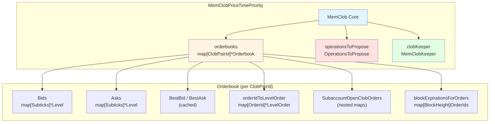
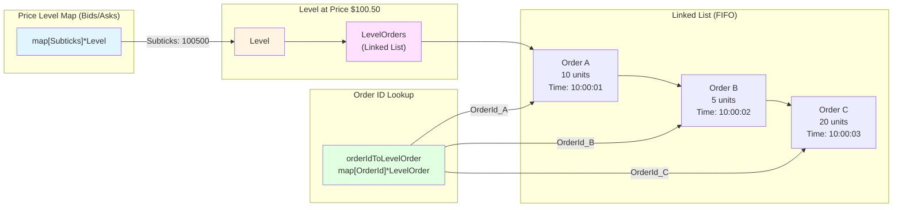
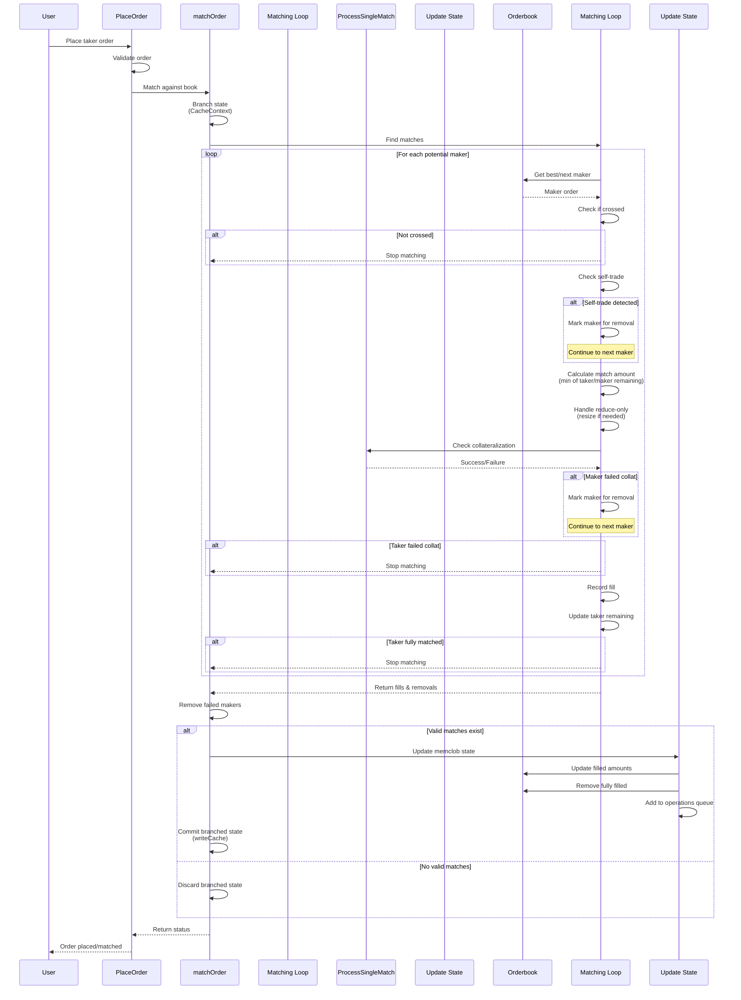
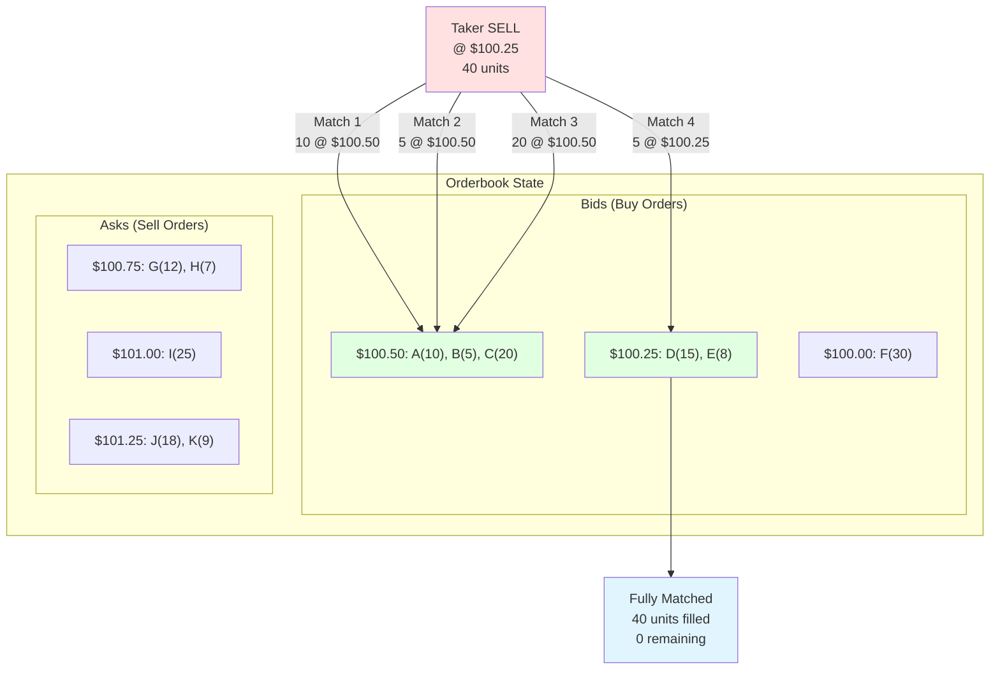
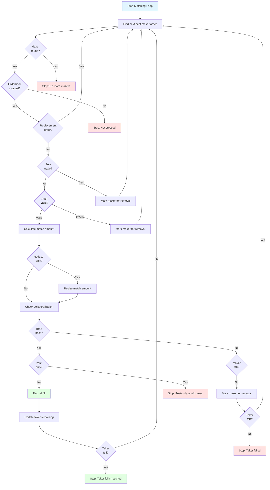
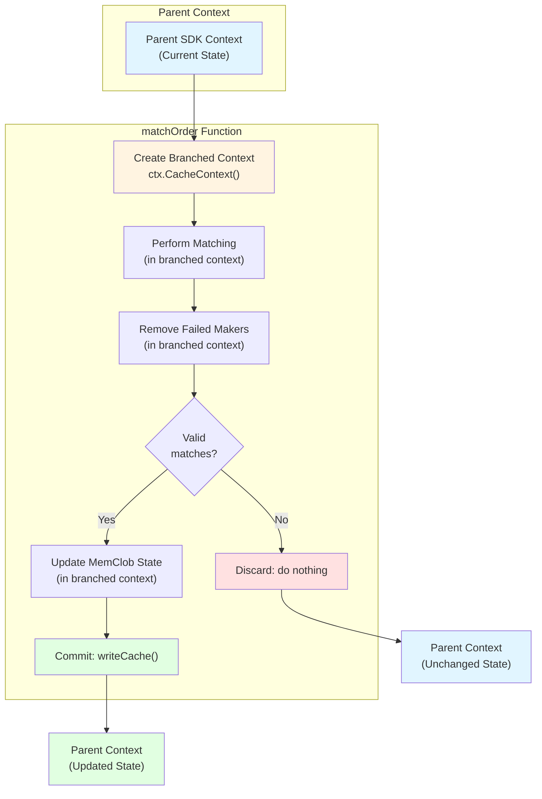
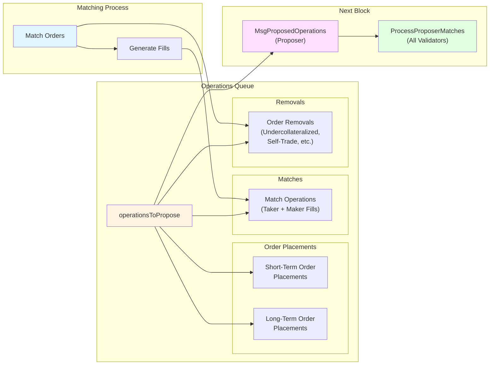
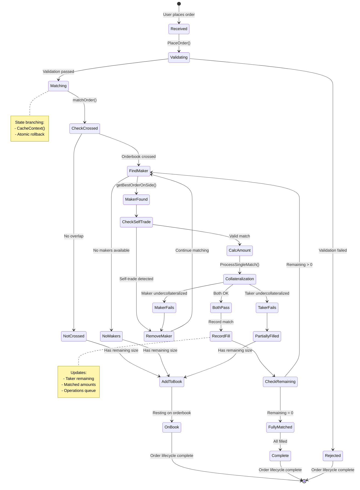

# Day 4 Architecture Diagrams - MemClob & Matching Engine

## 1. MemClob Overall Architecture

## 2. Orderbook Data Structure Detail

## 3. Matching Engine Flow

## 4. Price-Time Priority Visualization

## 5. Matching Loop Decision Tree

## 6. State Branching Pattern

## 7. Operations Queue Integration

## 8. Complete Order Lifecycle (Day 4 Focus)

---

## Key Insights from Diagrams

### 1. **Three-Layer Architecture**
- **MemClob**: Orchestrates multiple orderbooks
- **Orderbook**: Manages price levels and orders
- **Level**: Maintains FIFO order within price

### 2. **Hybrid Indexing**
- Price-level map for fast price lookup
- Linked lists for time priority
- Order ID map for O(1) removal

### 3. **State Branching Safety**
- All matching in isolated context
- Only commit if successful
- Automatic rollback on failure

### 4. **Deferred Maker Removal**
- Failed makers marked, not removed immediately
- Allows taker to continue matching
- Batch removal after matching completes

### 5. **Operations Queue Bridge**
- Matching generates operations
- Operations proposed in next block
- All validators process same operations
- Deterministic consensus achieved
