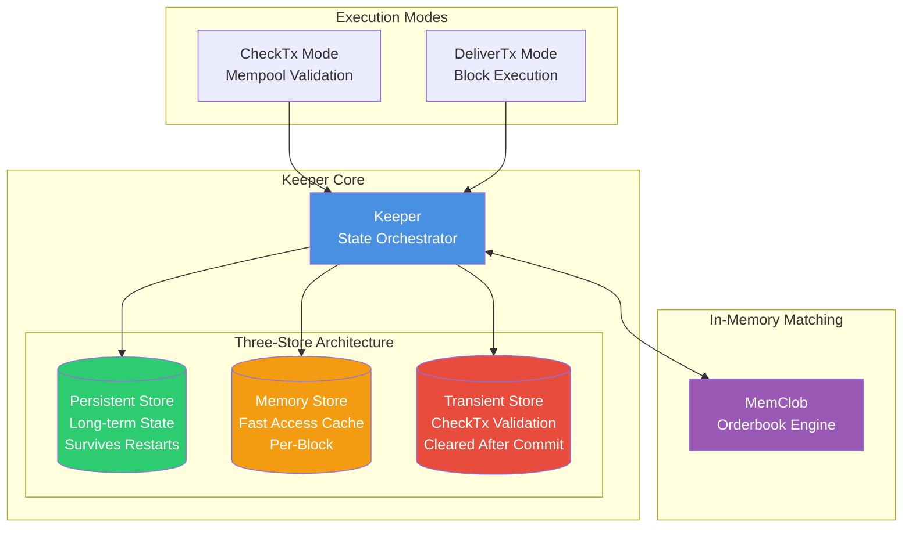
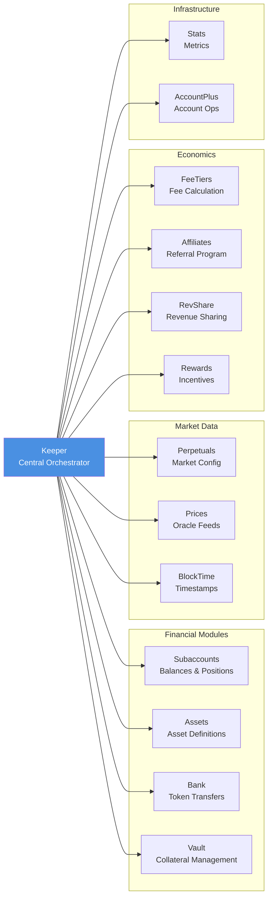
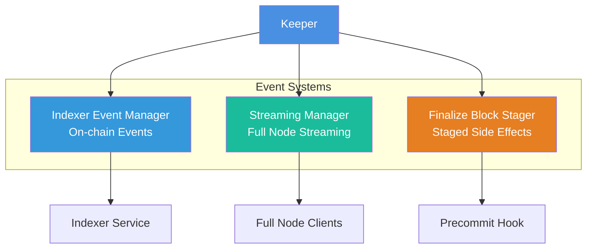
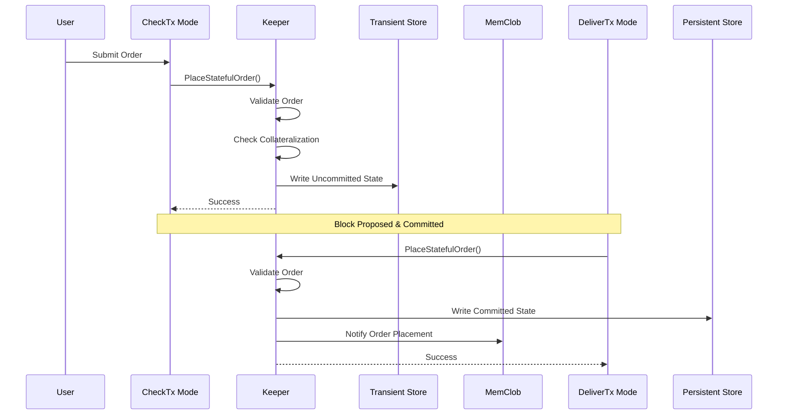
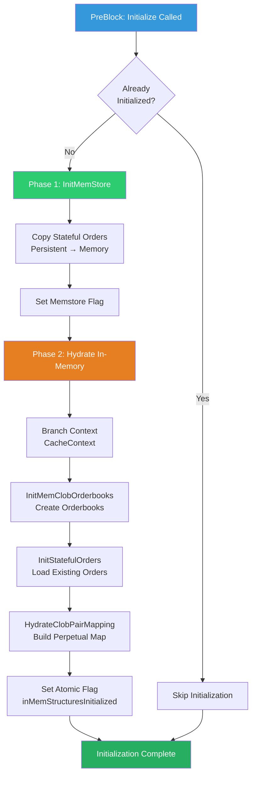

# Keeper Architecture Diagram

## Overview

The Keeper is the **central orchestrator** of the CLOB module, coordinating state management across 11 different modules with a sophisticated three-store architecture.

---

## Component Architecture



---

## Cross-Module Dependencies (11 Modules)



---

## Event Management & Streaming



---

## Data Flow: Order Placement



---

## Initialization Flow



---

## Three-Store Architecture Details

### Persistent Store
- **Type**: On-disk KV store
- **Lifetime**: Permanent (survives restarts)
- **Contents**:
  - Long-term order placements
  - TWAP order placements
  - Conditional order placements (triggered/untriggered)
  - Order fill amounts
  - CLOB pair configurations
  - Order expiration indices

### Memory Store
- **Type**: In-memory KV store
- **Lifetime**: Per-block (rebuilt on restart)
- **Contents**:
  - Cached stateful orders (copied from persistent)
  - Stateful order count
  - Memstore initialized flag
- **Purpose**: Fast read access without disk I/O

### Transient Store
- **Type**: Temporary KV store
- **Lifetime**: Cleared after commit
- **Contents**:
  - Uncommitted stateful order placements (CheckTx)
  - Uncommitted stateful order cancellations (CheckTx)
  - Staged finalize block events
- **Purpose**: Validation without state pollution

---

## CheckTx vs DeliverTx Pattern

```mermaid
flowchart LR
    subgraph "CheckTx Flow"
        CT_Start[Order Received]
        CT_Validate[Validate Order]
        CT_Write[Write to<br/>Transient Store]
        CT_Return[Return Success]
        
        CT_Start --> CT_Validate
        CT_Validate --> CT_Write
        CT_Write --> CT_Return
    end
    
    subgraph "DeliverTx Flow"
        DT_Start[Order in Block]
        DT_Validate[Validate Order]
        DT_Write[Write to<br/>Persistent Store]
        DT_Memstore[Update<br/>Memory Store]
        DT_Return[Return Success]
        
        DT_Start --> DT_Validate
        DT_Validate --> DT_Write
        DT_Write --> DT_Memstore
        DT_Memstore --> DT_Return
    end
    
    CT_Return -.->|Block Proposed| DT_Start
    
    style CT_Write fill:#E74C3C,color:#fff
    style DT_Write fill:#2ECC71,color:#fff
    style DT_Memstore fill:#F39C12,color:#fff
```



---

## Keeper Responsibilities Summary

| Responsibility | Description |
|----------------|-------------|
| **State Management** | Coordinate reads/writes across 3 stores |
| **Order Validation** | Stateful validation for all order types |
| **Collateralization** | Check account solvency before order placement |
| **Cross-Module Coordination** | Interact with 11 different modules |
| **Event Emission** | Generate indexer and streaming events |
| **Rate Limiting** | Prevent spam with rate limiters |
| **Initialization** | Hydrate in-memory structures on startup |
| **Side Effect Staging** | Stage finalize-block side effects |

---

## Key Design Patterns

### 1. Atomic Initialization
```go
inMemStructuresInitialized *atomic.Bool
```
- Thread-safe initialization flag
- Ensures single initialization across goroutines
- `Swap(true)` returns old value atomically

### 2. Context Branching
```go
checkCtx, _ := ctx.CacheContext()
checkCtx = checkCtx.WithIsCheckTx(true)
```
- Hydration without state pollution
- Operations queue updated, state changes discarded
- Prevents consensus-breaking writes in PreBlock

### 3. Conditional State Writes
```go
if lib.IsDeliverTxMode(ctx) {
    // Write to persistent store
} else {
    // Write to transient store
}
```
- Separates validation from execution
- Mempool validation doesn't pollute committed state
- Enables optimistic order checking

### 4. Staged Side Effects
```go
k.finalizeBlockEventStager.StageEvent(ctx, event)
// Later in Precommit:
k.ProcessStagedFinalizeBlockEvents(ctx)
```
- Defer in-memory side effects until after commit
- Prevents consensus issues with MemClob modifications
- Applied in Precommit hook

---

## Performance Optimizations

1. **Memory Store Caching**
   - Stateful orders cached in memory
   - Avoids repeated disk reads
   - Rebuilt from persistent on restart

2. **Transient Store for Validation**
   - CheckTx doesn't touch persistent store
   - Fast mempool validation
   - Cleared after each commit

3. **Atomic Operations**
   - Lock-free initialization check
   - Thread-safe state management
   - No mutex overhead

4. **Batched Event Processing**
   - Staged events processed in batch
   - Reduces overhead in Precommit
   - Efficient side effect application

---

## Critical Invariants

1. **Single Initialization**: `inMemStructuresInitialized` ensures one-time hydration
2. **Store Consistency**: Memstore always reflects subset of persistent store
3. **Transient Isolation**: CheckTx state never leaks to DeliverTx
4. **Event Ordering**: Staged events processed in FIFO order
5. **Cross-Module Sync**: All 11 modules remain consistent with keeper state
