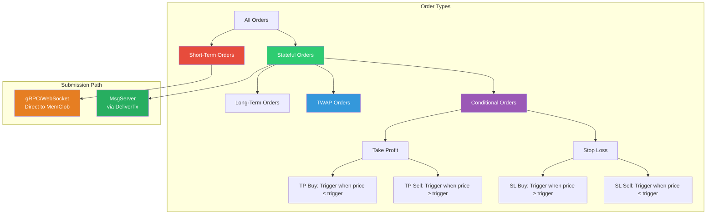
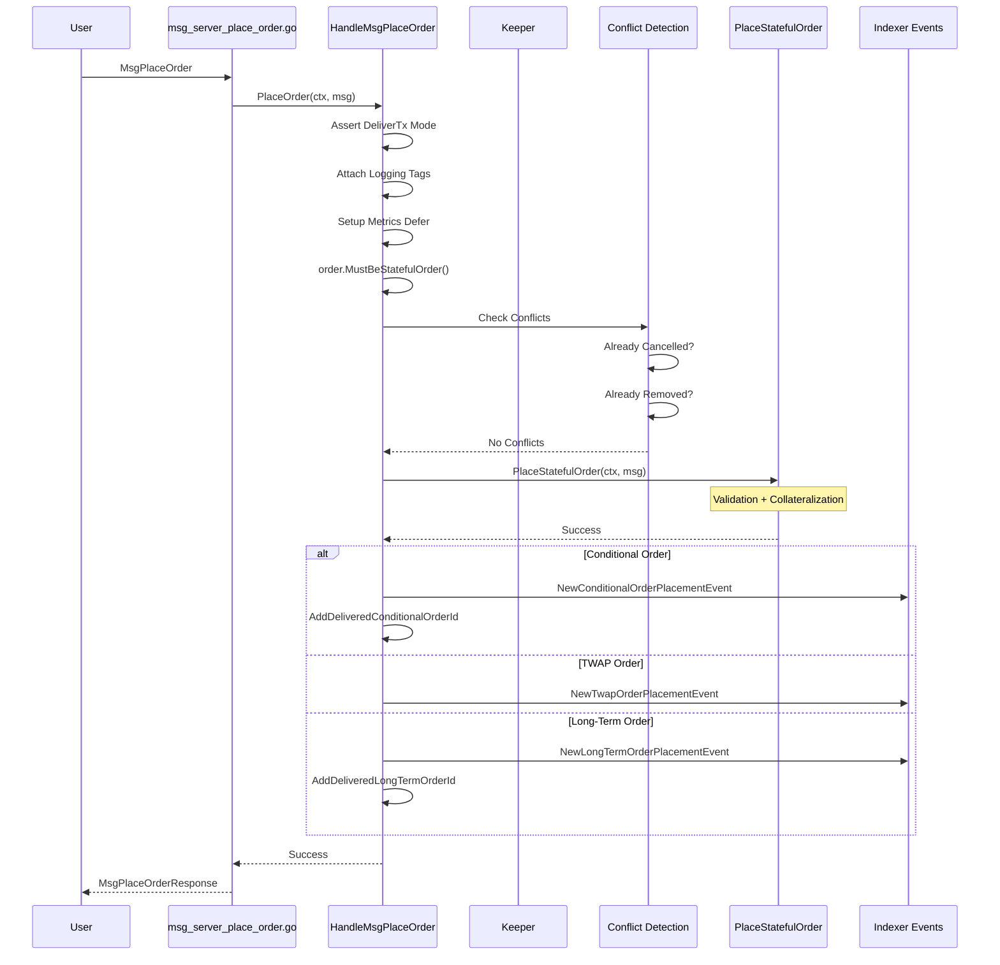
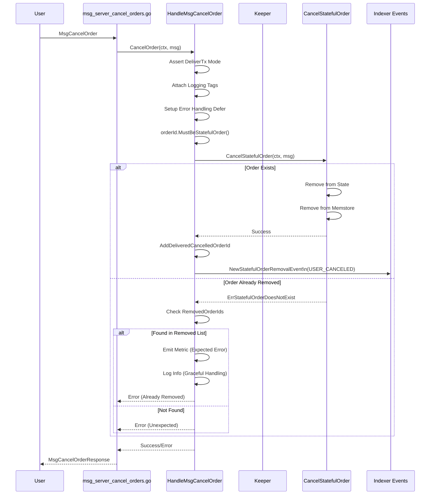
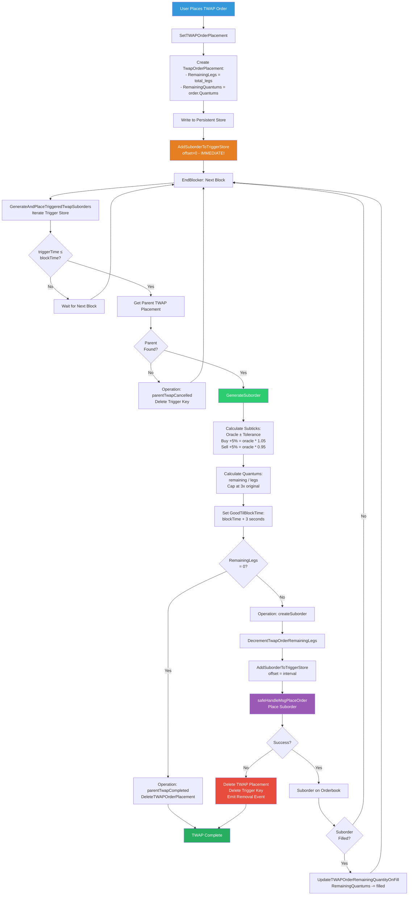
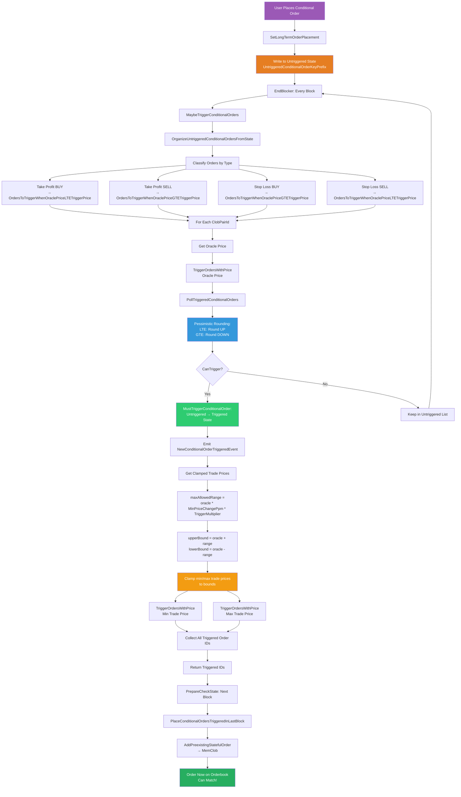
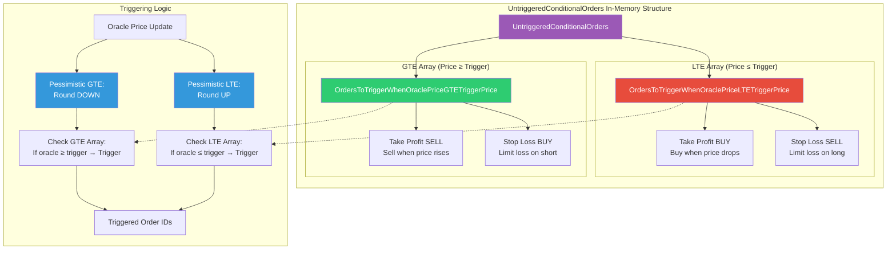
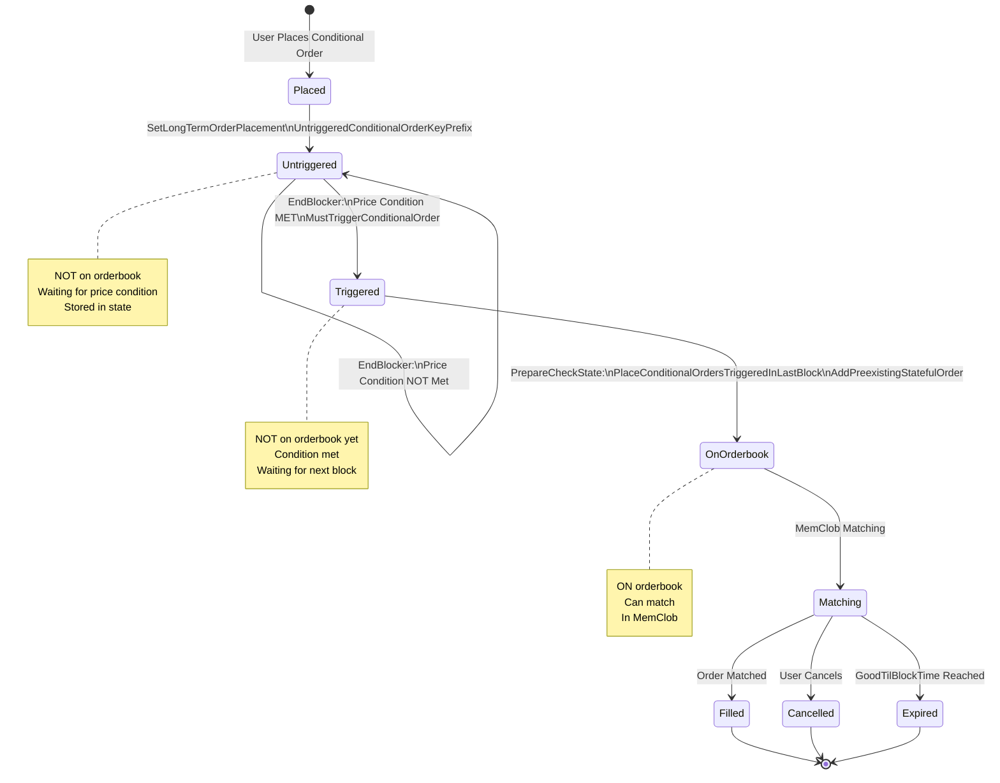
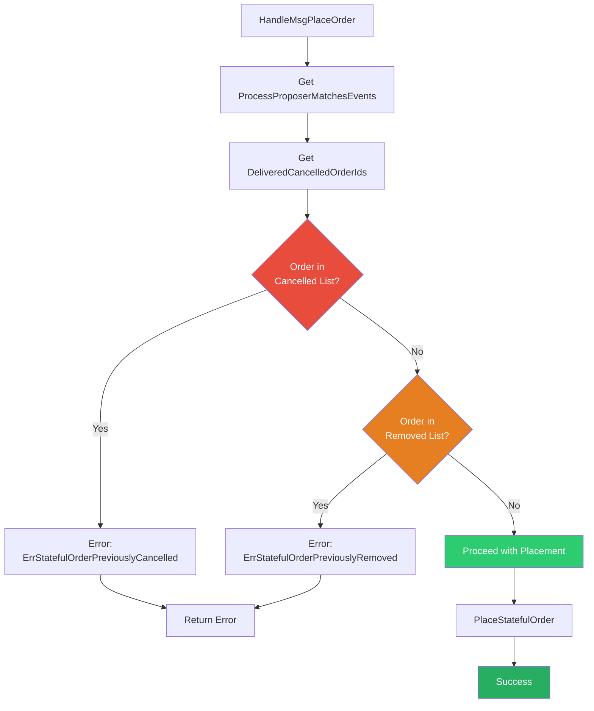
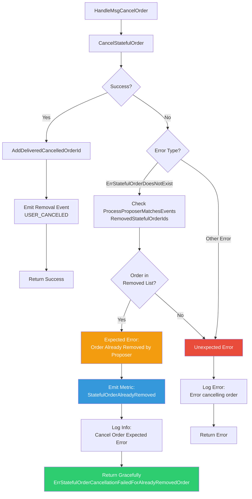
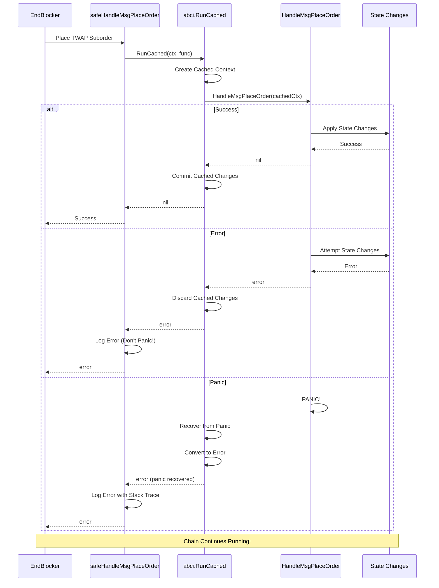

# Order Lifecycle Architecture Diagram

## Overview

This document visualizes the complete order lifecycle in the dYdX v4 CLOB module, covering order placement, cancellation, TWAP execution, and conditional order triggering mechanisms studied in Day 3.

---

## Order Type Classification



---

## Stateful Order Placement Flow



---

## Order Cancellation Flow



---

## TWAP Order Complete Lifecycle



---

## TWAP Trigger Store Mechanism

```mermaid
graph TB
    subgraph "TWAP Trigger Store"
        TriggerStore[(Trigger Store\nKey: [timestamp][suborderId]\nValue: empty)]
        
        subgraph "Scheduled Suborders"
            T0[T=0: First Suborder\nIMMEDIATE]
            T1[T=interval: Second Suborder]
            T2[T=2*interval: Third Suborder]
            T3[T=3*interval: Fourth Suborder]
        end
        
        TriggerStore --> T0
        TriggerStore --> T1
        TriggerStore --> T2
        TriggerStore --> T3
    end
    
    subgraph "EndBlocker Processing"
        EndBlocker[EndBlocker Called]
        Iterator[Iterate Trigger Store\nSorted by Timestamp]
        Process[Process Triggered\ntriggerTime ≤ blockTime]
        
        EndBlocker --> Iterator
        Iterator --> Process
    end
    
    T0 --> Process
    T1 -.->|Future| Wait[Wait for Block]
    T2 -.->|Future| Wait
    T3 -.->|Future| Wait
    
    Process --> Generate[Generate Suborder]
    Generate --> Place[Place on Orderbook]
    Place --> Schedule[Schedule Next\noffset = interval]
    Schedule --> TriggerStore
    
    style T0 fill:#27AE60,color:#fff
    style T1 fill:#F39C12,color:#fff
    style T2 fill:#F39C12,color:#fff
    style T3 fill:#F39C12,color:#fff
    style Process fill:#3498DB,color:#fff
```

---

## TWAP Price & Size Calculation

```mermaid
flowchart LR
    subgraph "Price Calculation"
        PriceStart[Suborder Price Needed]
        
        PriceStart --> HasSubticks{Parent TWAP\nhas subticks?}
        
        HasSubticks -->|Yes| UseParent[Use Parent Subticks]
        
        HasSubticks -->|No| GetOracle[Get Oracle Price]
        GetOracle --> GetTolerance[Get PriceTolerance PPM]
        GetTolerance --> CheckSide{Order Side?}
        
        CheckSide -->|Buy| AdjustUp[Adjustment = 1M + tolerance\nWilling to pay MORE]
        CheckSide -->|Sell| AdjustDown[Adjustment = 1M - tolerance\nWilling to accept LESS]
        
        AdjustUp --> ApplyAdj[adjustedPrice = oracle * adjustment / 1M]
        AdjustDown --> ApplyAdj
        
        ApplyAdj --> Round[Round to SubticksPerTick Multiple]
        
        Round --> PriceDone[Suborder Subticks]
        UseParent --> PriceDone
    end
    
    subgraph "Size Calculation"
        SizeStart[Suborder Size Needed]
        
        SizeStart --> CalcOriginal[originalQuantumsPerLeg =\noriginalQuantums / totalLegs]
        CalcOriginal --> CalcRemaining[remainingQuantumsPerLeg =\nremainingQuantums / remainingLegs]
        CalcRemaining --> CalcMax[maxSuborderSize =\noriginalQuantumsPerLeg * 3]
        CalcMax --> TakeMin[suborderQuantums =\nmin(remaining, max)]
        TakeMin --> RoundDown[Round down to\nStepBaseQuantums]
        RoundDown --> CheckZero{Result = 0?}
        CheckZero -->|Yes| NoOrder[Cannot place suborder]
        CheckZero -->|No| SizeDone[Suborder Quantums]
    end
    
    style AdjustUp fill:#2ECC71,color:#fff
    style AdjustDown fill:#E74C3C,color:#fff
    style CalcMax fill:#E67E22,color:#fff
    style PriceDone fill:#3498DB,color:#fff
    style SizeDone fill:#3498DB,color:#fff
```

---

## Conditional Order Complete Lifecycle



---

## Conditional Order Triggering - Two-Array Structure



---

## Conditional Order State Transitions



---

## Three Price Sources for Conditional Triggering

```mermaid
flowchart TB
    subgraph "Price Sources"
        Oracle[Oracle Price\nPrimary Source]
        MinTrade[Min Trade Price\nActual Market Low]
        MaxTrade[Max Trade Price\nActual Market High]
    end
    
    subgraph "Clamping Logic"
        CalcRange[Calculate Allowed Range:\nmaxRange = oracle * MinPriceChangePpm * TriggerMultiplier]
        
        CalcRange --> Bounds[upperBound = oracle + maxRange\nlowerBound = oracle - maxRange]
        
        Bounds --> ClampMin[clampedMin = Clamp(minTrade, lower, upper)]
        Bounds --> ClampMax[clampedMax = Clamp(maxTrade, lower, upper)]
    end
    
    Oracle --> TriggerA[Trigger Attempt 1:\nOracle Price]
    MinTrade --> CalcRange
    MaxTrade --> CalcRange
    
    ClampMin --> TriggerB[Trigger Attempt 2:\nClamped Min Trade Price]
    ClampMax --> TriggerC[Trigger Attempt 3:\nClamped Max Trade Price]
    
    TriggerA --> Collect[Collect All Triggered Orders]
    TriggerB --> Collect
    TriggerC --> Collect
    
    Collect --> Result[All Triggered Order IDs]
    
    style Oracle fill:#3498DB,color:#fff
    style MinTrade fill:#2ECC71,color:#fff
    style MaxTrade fill:#E74C3C,color:#fff
    style Bounds fill:#F39C12,color:#fff
    style Result fill:#9B59B6,color:#fff
```

---

## Conflict Detection in Order Placement



---

## Graceful Cancellation Error Handling



---

## Safe Execution Pattern (EndBlocker)



---

## Order Lifecycle Summary Table

| Order Type | Submission | Storage | Lifetime | On Orderbook | Triggering |
|------------|------------|---------|----------|--------------|------------|
| **Short-Term** | gRPC/WebSocket | MemClob only | Max 20 blocks | Immediate | N/A |
| **Long-Term** | MsgPlaceOrder | Persistent + MemClob | Up to 95 days | Immediate | N/A |
| **TWAP** | MsgPlaceOrder | Persistent (parent) | Until complete | Suborders only | Time-based (trigger store) |
| **Conditional** | MsgPlaceOrder | Persistent (untriggered) | Until triggered/expired | After trigger | Price-based (oracle + trade) |

---

## Key Design Patterns

### 1. Conflict Detection
```go
// Check if order was already cancelled or removed in this block
cancelledOrderIds := lib.UniqueSliceToSet(k.GetDeliveredCancelledOrderIds(ctx))
removedOrderIds := lib.UniqueSliceToSet(processProposerMatchesEvents.RemovedStatefulOrderIds)
```
- Prevents placing already-cancelled/removed orders
- Ensures consistency within a block
- Protects against race conditions

### 2. TWAP Trigger Store Scheduling
```go
// Key format: [timestamp][suborderId]
triggerKey := types.GetTWAPTriggerKey(triggerTime, suborderId)
triggerStore.Set(triggerKey, []byte{})
```
- Sorted by timestamp for efficient iteration
- Empty value (key contains all info)
- First suborder has offset=0 (immediate)

### 3. Pessimistic Rounding for Conditional Orders
```go
// Round UP for LTE conditions (conservative)
pessimisticLTESubticks := lib.BigRatRound(oraclePriceSubticksRat, true)

// Round DOWN for GTE conditions (conservative)
pessimisticGTESubticks := lib.BigRatRound(oraclePriceSubticksRat, false)
```
- Only trigger when absolutely sure
- Prevents premature triggering
- Protects users from unfair execution

### 4. Safe Execution in EndBlocker
```go
if err = abci.RunCached(ctx, func(ctx sdk.Context) error {
    return k.HandleMsgPlaceOrder(ctx, msg, isStateful)
}); err != nil {
    k.Logger(ctx).Error("failed to handle TWAP suborder placement (panic recovered)")
    return err
}
```
- Panic recovery prevents chain halts
- Cached context isolates state changes
- Graceful degradation on errors

---

## Critical Invariants

1. **Stateful-Only MsgServer**: Short-term orders never reach `msg_server_place_order.go`
2. **Conflict Prevention**: No order can be placed if cancelled/removed in same block
3. **TWAP Parent Never on Orderbook**: Only suborders are placed on MemClob
4. **Conditional Two-State Lifecycle**: Untriggered → Triggered → On Orderbook
5. **Pessimistic Triggering**: Only trigger when price condition is definitely met
6. **Three Price Sources**: Oracle + clamped min/max trade prices
7. **First TWAP Suborder Immediate**: Trigger offset = 0 for first execution
8. **Safe EndBlocker Execution**: Panics recovered, chain never halts
9. **Graceful Cancellation**: Already-removed orders handled without error
10. **TWAP Catchup Cap**: Suborders capped at 3x original size per leg

---

## Performance Considerations

1. **TWAP Trigger Store Iteration**
   - Sorted by timestamp (efficient range query)
   - Only process triggered orders (triggerTime ≤ blockTime)
   - Early break when future orders encountered

2. **Conditional Order Classification**
   - Two-array structure for efficient polling
   - Separate LTE and GTE conditions
   - No need to check all orders for every price update

3. **Conflict Detection**
   - Set-based lookups (O(1) average case)
   - Only checks current block's cancelled/removed orders
   - Minimal overhead

4. **Safe Execution Overhead**
   - Cached context for state isolation
   - Only used in EndBlocker (not hot path)
   - Panic recovery worth the cost

---

## Integration Points

### With Keeper (Day 2)
- `PlaceStatefulOrder()` - Validation and collateralization
- `CancelStatefulOrder()` - State and memstore removal
- Three-store architecture for state management

### With MemClob (Day 4 Preview)
- `AddPreexistingStatefulOrder()` - Place triggered conditional orders
- `PlaceOrder()` - Place TWAP suborders
- Order matching and execution

### With Indexer
- `NewConditionalOrderPlacementEvent`
- `NewTwapOrderPlacementEvent`
- `NewLongTermOrderPlacementEvent`
- `NewStatefulOrderRemovalEvent`
- `NewConditionalOrderTriggeredEvent`

---

## Questions for Day 4

1. How does MemClob actually match orders?
2. What is the orderbook data structure?
3. How are matches processed and persisted?
4. What is the operations queue?
5. How does proposer operation validation work?
