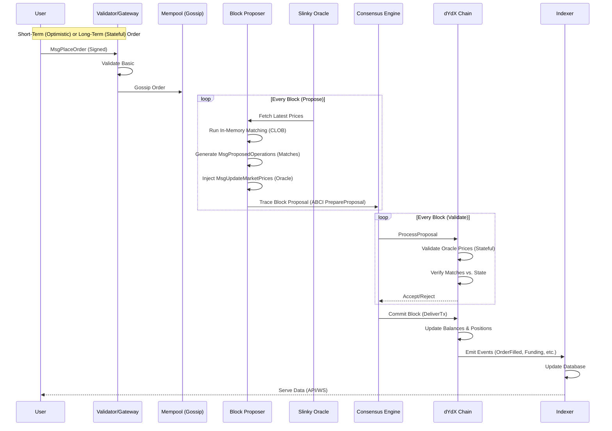

# dYdX v4 Trade Lifecycle Flow

## Overview
This document outlines the complete lifecycle of a trade on the dYdX v4 chain, from the initial user signature to final on-chain settlement and indexing. It utilizes a hybrid model where order matching happens "off-chain" (in the Proposer's memory) but is verified and settled "on-chain" by consensus.

### Architecture Diagram

---

## Detailed Step-by-Step Flow

### 1. Order Placement
*   **User Action**: The trader signs a `MsgPlaceOrder` transaction.
*   **Gateway**: The transaction is sent to a Validator or Sentry node's Gateway.
*   **Validation**: The node performs basic stateless validation (signatures, formatting).
*   **Routing**:
    *   **Short-Term Orders**: Placed optimistically in the mempool. They expire quickly.
    *   **Long-Term Orders**: Standard stateful orders (Good-Til-Cancel).

### 2. Mempool & Gossip
*   **Gossip**: Valid orders are gossiped via the CometBFT mempool protocol.
*   **In-Memory Orderbook**: Each validator maintains a local, in-memory CLOB.

### 3. Block Proposal & Matching (Off-Chain Logic)
The protocol uses ABCI++ `PrepareProposal` to construct blocks:
*   **Proposer**: Acts as the "Matching Engine".
*   **Tx Injection**:
    1.  **`MsgUpdateMarketPrices`**: Fetched from **Slinky Oracle** sidecar.
    2.  **`MsgAddPremiumVotes`**: Funding rate updates.
    3.  **`MsgProposedOperations`**: List of **matched pairs** (Order A match Order B).
*   **Matching**: The proposer runs its engine against mempool orders to generate `MsgProposedOperations`.

### 4. Consensus & Verification (On-Chain Logic)
Validators verify the proposal using `ProcessProposal`:
*   **Oracle Verification**: Check `MsgUpdateMarketPrices` against local Slinky sidecar. Rejects if deviation is too high.
*   **Match Verification**: Re-run logic for `MsgProposedOperations`. Verify orders exist, prices cross, and collateral is sufficient.
*   **Consensus**: Block committed if >2/3 validators accept.

### 5. Execution & Settlement
*   **DeliverTx**: Chain executes transactions.
*   **State Update**: Balances transferred, positions updated.

### 6. Indexing
*   **Event Emission**: Chain emits `OrderFilled`, `SubaccountUpdate`, etc.
*   **Indexer**: Listens to events, updates database (PostgreSQL).
*   **User Interface**: Frontend queries Indexer API for trade history/PnL.

---

## Key Components

### Slinky Oracle
*   **Role**: Provides high-frequency price feeds.
*   **Integration**: Sidecar process.
*   **Just-In-Time Pricing**: Prices fetched at block proposal time for accurate matching.

### Validator Service
*   **Role**: Gateway for ingestion, rate limiting, and forwarding.

### Indexer
*   **Role**: Off-chain data aggregator (history, candles). Chain stores state; Indexer stores history.
