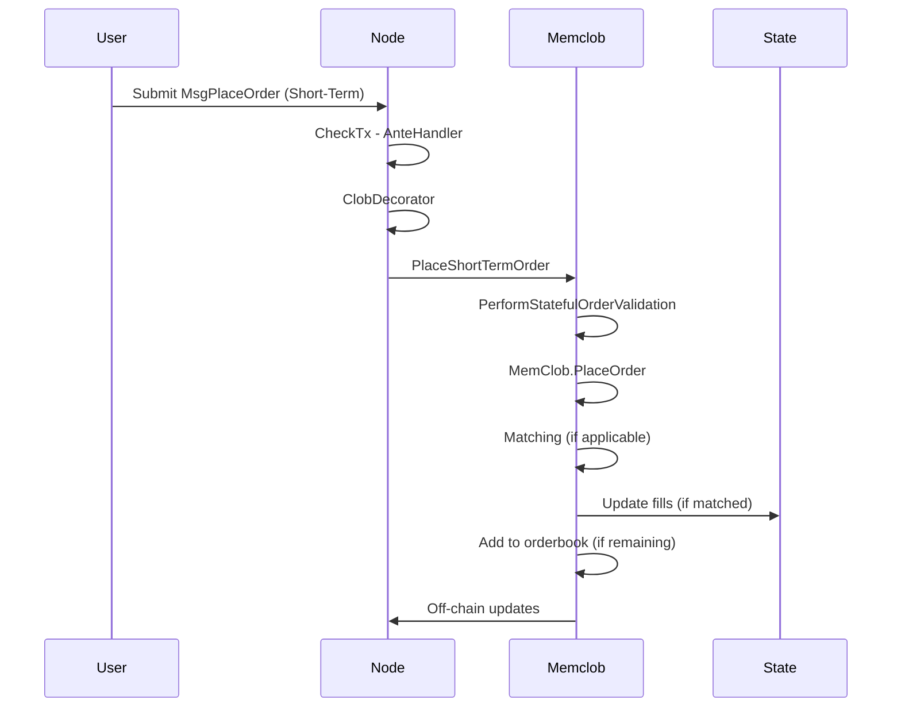
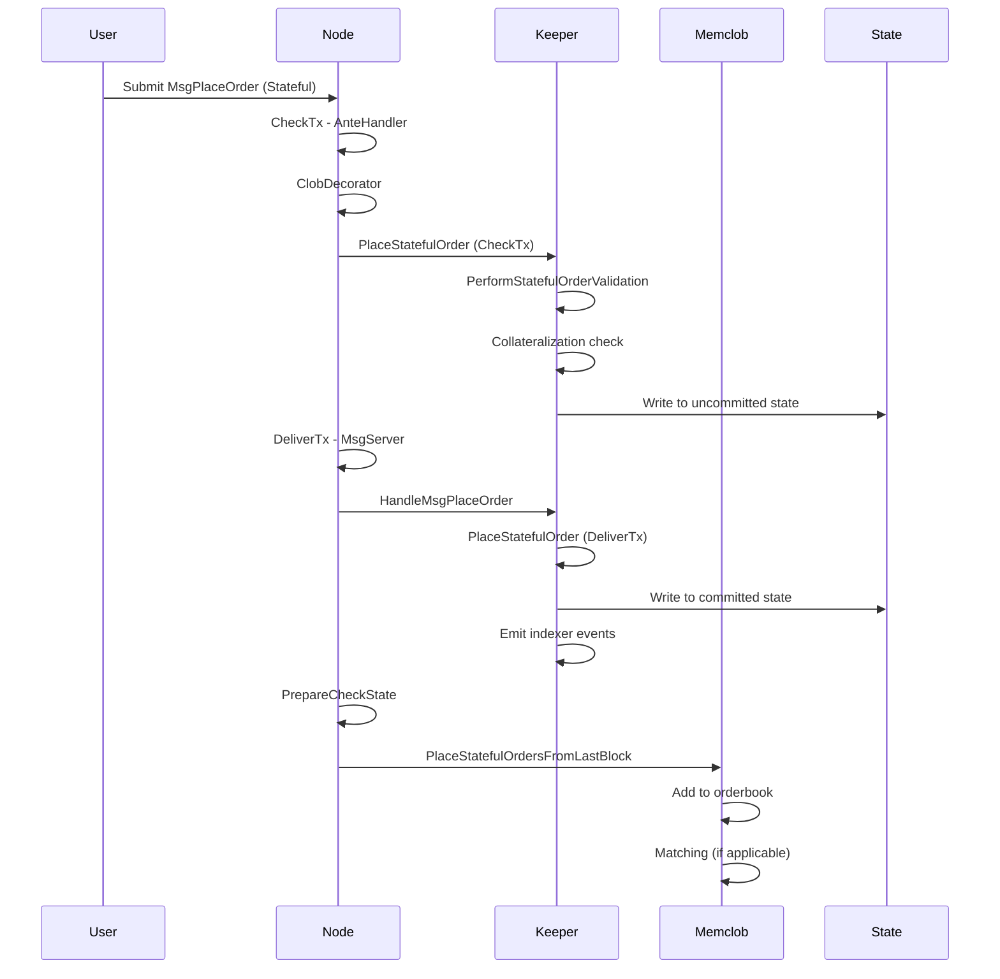

# MsgPlaceOrder Flow Documentation

## Overview

This document provides a comprehensive explanation of how `MsgPlaceOrder` is processed in the dYdX v4 chain protocol. The flow differs significantly depending on whether the order is a Short-Term order or a Stateful order (Long-Term, Conditional, or TWAP).

## Order Types

### Short-Term Orders

- Exist only in memory
- Expire at a specific block height (GoodTilBlock)
- Processed immediately in CheckTx
- Do not persist across node restarts

### Stateful Orders

- Persisted in blockchain state
- Expire at a specific timestamp (GoodTilBlockTime)
- Include Long-Term, Conditional, and TWAP orders
- Survive node restarts
- Processed in DeliverTx with delayed matching

## Complete Flow

### 1. Transaction Submission

A user submits a transaction containing a `MsgPlaceOrder` message through CLI, REST API, or other interfaces. The transaction is signed and broadcast to a full node.

### 2. CheckTx Processing (AnteHandler)

#### For Short-Term Orders

1. Transaction enters mempool
2. `CheckTx` is called on the transaction
3. AnteHandler chain executes:
   - Authentication and signature verification
   - Gas consumption and fee deduction
   - CLOB-specific processing via `ClobDecorator`
4. `ClobDecorator.AnteHandle` processes the order:
   - Validates it's a Short-Term order
   - Calls `Keeper.PlaceShortTermOrder`

#### For Stateful Orders

1. Transaction enters mempool
2. `CheckTx` is called on the transaction
3. AnteHandler chain executes:
   - Authentication and signature verification
   - Gas consumption and fee deduction
   - CLOB-specific processing via `ClobDecorator`
4. `ClobDecorator.AnteHandle` processes the order:
   - Validates it's a Stateful order
   - Calls `Keeper.PlaceStatefulOrder` with `isInternalOrder=false`

### 3. Short-Term Order Processing (`PlaceShortTermOrder`)

Located in `x/clob/keeper/orders.go`, this function:

1. **Validation**:
   - Asserts CheckTx mode
   - Performs stateful validation via `PerformStatefulOrderValidation`

2. **Order Placement**:
   - Calls `MemClob.PlaceOrder` to place the order on the in-memory orderbook

3. **Matching**:
   - Immediate matching against existing orders occurs in memclob
   - Subaccount updates are applied for matched portions

4. **State Updates**:
   - If order has remaining size, it's added to the orderbook
   - Off-chain updates are generated and sent

5. **Operations Queue**:
   - Order placement is added to operations queue for block proposal

### 4. Stateful Order Processing (`PlaceStatefulOrder`)

Located in `x/clob/keeper/orders.go`, this function:

1. **Validation**:
   - Asserts order is Stateful
   - Performs stateful validation via `PerformStatefulOrderValidation`
   - Checks equity tier limits
   - Performs collateralization check via `AddOrderToOrderbookSubaccountUpdatesCheck`

2. **State Persistence**:
   - In DeliverTx mode:
     - Writes order to state using `SetLongTermOrderPlacement` or `SetTWAPOrderPlacement`
     - Adds order expiration to state
   - In CheckTx mode:
     - Writes order to uncommitted state using `MustAddUncommittedStatefulOrderPlacement`

3. **Indexer Events**:
   - Emits appropriate indexer events for the order type

### 5. DeliverTx Processing

#### For Short-Term Orders

- Already processed in CheckTx
- Minimal additional processing in DeliverTx

#### For Stateful Orders

1. `DeliverTx` routes message to `MsgServer.PlaceOrder`
2. `MsgServer.PlaceOrder` calls `HandleMsgPlaceOrder`
3. `HandleMsgPlaceOrder` calls `PlaceStatefulOrder` (already validated in CheckTx)
4. Order is written to committed state
5. Indexer events are emitted

### 6. PrepareCheckState (Next Block)

This ABCI hook runs at the beginning of each block:

1. **Replay Operations**:
   - Local validator replays its own operations via `MemClob.ReplayOperations`

2. **Stateful Order Placement**:
   - Calls `PlaceStatefulOrdersFromLastBlock` to place stateful orders on memclob
   - Calls `PlaceConditionalOrdersTriggeredInLastBlock` for triggered conditional orders

3. **Matching**:
   - Previously placed stateful orders can now match against new orders

### 7. Order Matching

When an order is placed on the memclob:

1. **Validation**:
   - Order passes memclob validation via `validateNewOrder`

2. **Matching Loop** (`mustPerformTakerOrderMatching`):
   - Finds best matching orders on opposite side
   - Checks if orders cross (price overlap)
   - Performs collateralization checks via `ProcessSingleMatch`
   - Creates fills for matched portions

3. **State Updates**:
   - Updates subaccount balances and positions
   - Records fill amounts in state
   - Removes fully filled orders from orderbook

4. **Off-chain Updates**:
   - Generates messages for indexer and streaming

## Key Differences Between Order Types

| Aspect | Short-Term Orders | Stateful Orders |
| -------- | ------------------- | ----------------- |
| Processing Time | CheckTx | CheckTx (validation) + DeliverTx (persistence) |
| Persistence | Memory only | Blockchain state |
| Matching Time | Immediate | Next block (PrepareCheckState) |
| Expiration | Block height (GTB) | Timestamp (GTBT) |
| Recovery | Lost on restart | Restored on restart |
| Replacement | Not supported | Not supported (TODO) |

## Component Interactions

### Keeper Functions

- `PlaceShortTermOrder`: Handles immediate placement and matching
- `PlaceStatefulOrder`: Handles validation and persistence
- `PerformStatefulOrderValidation`: Core validation logic
- `AddOrderToOrderbookSubaccountUpdatesCheck`: Collateralization check

### Memclob Functions

- `PlaceOrder`: Core matching engine
- `mustPerformTakerOrderMatching`: Matching algorithm
- `mustAddOrderToOrderbook`: Adds orders to in-memory book
- `mustUpdateMemclobStateWithMatches`: Updates state after matching

### ABCI Hooks

- `PrepareCheckState`: Places stateful orders on memclob
- `EndBlocker`: Handles order expiration and conditional triggers

## Error Handling

Different error types are handled appropriately:

- **Validation Errors**: Rejected immediately
- **Collateralization Errors**: Order placement fails but transaction may succeed
- **Matching Errors**: Partial fills possible
- **State Conflicts**: Duplicate order detection

## Flow Diagrams

### Short-Term Order Flow

### Stateful Order Flow

## Conclusion

The MsgPlaceOrder flow in dYdX v4 is designed to handle two distinct order types with different processing requirements. Short-Term orders prioritize speed and efficiency by processing entirely in memory during CheckTx, while Stateful orders emphasize persistence and reliability by storing in blockchain state and processing across multiple block phases. Understanding these flows is crucial for developers building on the protocol and for users who want to understand how their orders are processed.
