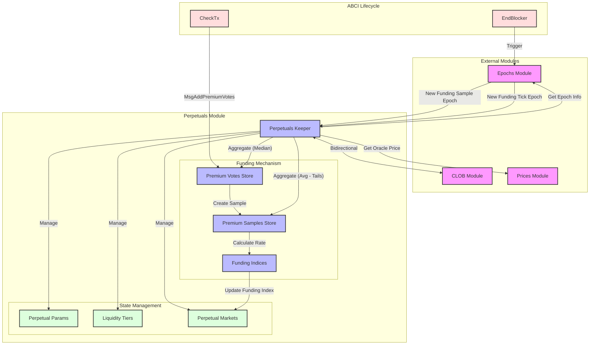

# Perpetuals Module Analysis

## Overview

The Perpetuals module manages the core perpetual futures trading functionality in the dYdX v4 protocol. It handles the creation and management of perpetual markets, administers the funding rate mechanism to tether perpetual prices to their underlying index prices, and manages liquidity tiers and insurance funds.

The module works in tight bidirectional synchronization with the CLOB (Central Limit Order Book) module: the CLOB handles the matching engine and order placement, while the Perpetuals module manages the market parameters, funding rates, and settlement mechanics.

## Architecture & Design

### Architecture Diagram


### Module Structure
- **Keeper**: The central orchestrator that manages perpetuals state, premium votes, and funding samples.
- **Types**: Defines core data structures like `Perpetual`, `LiquidityTier`, `FundingPremium`, and `PerpetualParams`.
- **ABCI Integration**: Uses `EndBlocker` to process funding samples and funding ticks at specific epoch intervals.
- **Funding Package**: Contains the mathematical logic for calculating funding index deltas.

### Dependencies
The Perpetuals module interacts with several other key modules:
- **CLOB Module**: Bidirectional dependency. The Perpetuals module queries the CLOB for premium data, while the CLOB relies on Perpetuals for market configurations.
- **Prices Module**: Provides oracle prices for the underlying assets, which are critical for funding rate calculations and net notional value determination.
- **Epochs Module**: Dictates the timing for "Funding Sample" and "Funding Tick" events, ensuring deterministic execution of funding mechanism.

### Market Types
The protocol supports two types of perpetual markets:
- **CROSS**: Standard cross-margin markets where collateral is shared across positions.
- **ISOLATED**: Isolated margin markets where collateral is segregated for specific positions.

---

## Key Mechanisms

### 1. Funding Rate Mechanism
The funding rate mechanism is the economic engine that keeps the perpetual price close to the index price. It uses a time-weighted average premium system.

#### Mechanism Flow:
1. **Premium Votes (CheckTx)**: Validators submit "premium votes" based on the difference between the impact bid/ask price and the index price.
2. **Premium Samples (Funding Sample Epoch)**: At the end of every `funding-sample` epoch (typically 1 minute), the protocol calculates the median of all collected premium votes. This median becomes a "Premium Sample".
3. **Funding Rate (Funding Tick Epoch)**: At the end of every `funding-tick` epoch (typically 1 hour), the protocol aggregates all premium samples collected during that hour.
   - It removes a small percentage of outliers (tails) from the top and bottom.
   - It calculates the average of the remaining samples to determine the **Premium Rate**.
   - **Funding Rate = Premium Rate + Default Funding Rate (interest rate)**

#### Formula
The funding index is updated using the following formula:
```
Funding Index Delta = Funding Rate PPM * (Time Delta / 8 hours) * Index Price
```
This calculation happens in `funding/funding.go` and handles the conversion between base and quote quantums to maintain precision.

### 2. Liquidity Tiers
Every perpetual market is assigned a **Liquidity Tier**, which defines its margin requirements. This allows the protocol to categorize assets by risk profile (e.g., highly liquid pairs like BTC-USD vs. tail assets).

Each Liquidity Tier defines:
- **Initial Margin PPM**: The base initial margin requirement (e.g., 5% or 50,000 PPM).
- **Maintenance Fraction PPM**: The fraction of initial margin required for maintenance (e.g., 0.5 or 50% of IM).
- **Impact Notional**: The notional size used to calculate the impact bid/ask price for premium votes.
- **Open Interest Caps**: Limits on total open interest to manage protocol risk.

### 3. Open Interest Margin Fraction (OIMF) Scaling
To protect the protocol from excessive exposure, the Initial Margin Fraction (IMF) scales up as Open Interest (OI) increases.

*   Each market has a **Lower Cap** and **Upper Cap** for OI.
*   **Base IMF**: The standard initial margin requirement.
*   **Scaling Logic**:
    *   If `OI < Lower Cap`: `Effective IMF = Base IMF`
    *   If `OI > Upper Cap`: `Effective IMF = 100%` (1:1 collateral)
    *   In between: The IMF scales linearly between the Base IMF and 100%.

This mechanism discourages massive positions in illiquid markets by making them capital-inefficient.

---

## ABCI Lifecycle Integration

The module relies heavily on ABCI hooks to execute its logic deterministically:

### EndBlocker
The `EndBlocker` in `abci.go` calls two key functions:

1.  **`MaybeProcessNewFundingSampleEpoch`**:
    *   Checks if the current block marks the start of a new Funding Sample epoch.
    *   If yes, it processes all accumulated **Premium Votes** into a single **Premium Sample** (median value).
    *   It stores this sample and clears the vote store.

2.  **`MaybeProcessNewFundingTickEpoch`**:
    *   Checks if the current block marks the start of a new Funding Tick epoch.
    *   If yes, it retrieves all **Premium Samples** collected since the last tick.
    *   It calculates the final **Funding Rate** (average of samples after tail removal).
    *   It applies this rate to update the **Funding Index** for the market.
    *   It emits events for indexers to track the new funding rates.

---

## State Management

The Keeper manages several critical stores:

*   **Perpetuals Store**: Permanent storage of market configurations (Ticker, ID, Params).
*   **Liquidity Tiers Store**: Configurations for different risk tiers.
*   **Premium Store**:
    *   **Premium Votes**: Transient storage for votes collected within a sample epoch.
    *   **Premium Samples**: Transient storage for samples collected within a tick epoch.

This separation of transient vs. permanent state ensures efficient processing while maintaining a persistent record of the core market parameters.

---

## Technical Insights

*   **Median for Robustness**: Using the median for Premium Samples makes the funding rate mechanism resistant to manipulation by a small number of malicious validators who might submit extreme votes.
*   **Tail Removal**: Removing top/bottom outliers before averaging samples further smoothens the funding rate and reduces volatility.
*   **Impact Notional**: Funding is calculated based on "Impact Prices" (price to execute a specific large size) rather than mid-prices. This effectively incorporates the order book depth into the funding rate, making it more expensive to hold positions in illiquid markets.
*   **Integer Math**: The module uses `big.Int` and Parts-Per-Million (PPM) arithmetic extensively to handle high-precision financial calculations without floating-point errors, critical for potential consensus determinism.
