# CLOB Module Component Relationships

This document details the relationships between different components within the CLOB module, showing how they interact to provide the complete order book functionality.

## 1. Core Architecture Components

### 1.1. Keeper ↔ MemClob Relationship

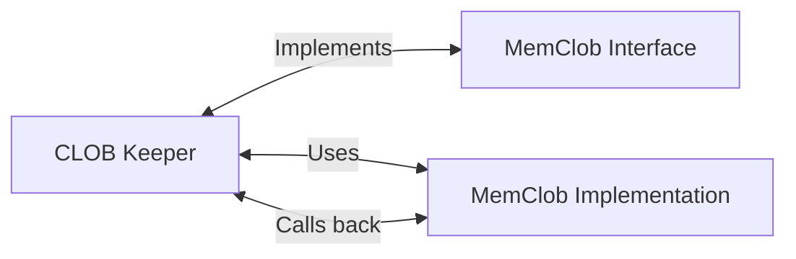

The Keeper acts as the main interface to the CLOB module, while the MemClob handles in-memory order book operations. They have a bidirectional relationship where:

- Keeper calls MemClob for order placement, cancellation, and matching
- MemClob calls back to Keeper for state queries and subaccount updates

### 1.2. Orderbook Data Structure Hierarchy

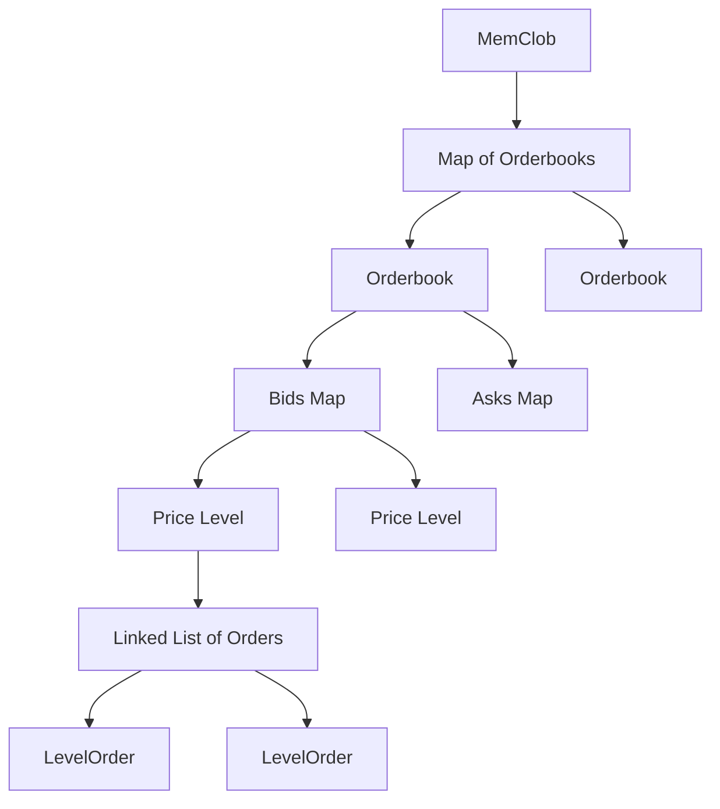

The hierarchical structure shows how orders are organized:

- MemClob contains multiple Orderbooks (one per market)
- Each Orderbook has separate Bids and Asks maps
- Maps are keyed by price levels (subticks)
- Each price level contains a linked list of orders

## 2. Order Processing Flow

### 2.1. Order Placement Sequence

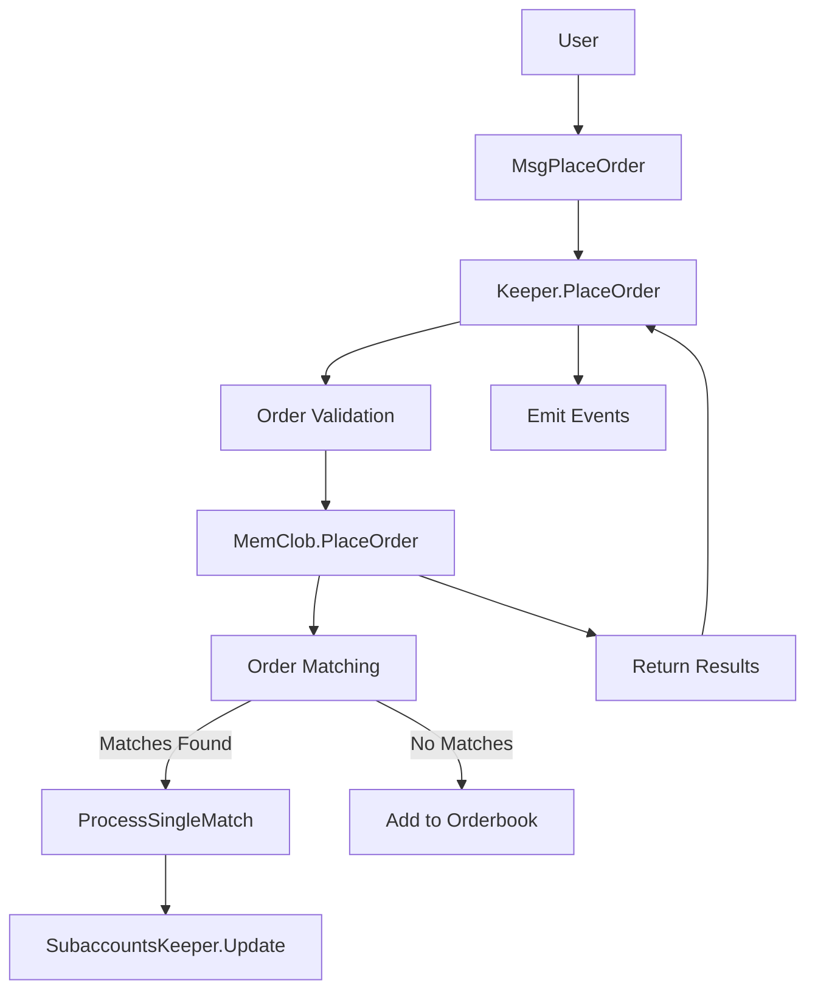

### 2.2. Match Processing Dependencies

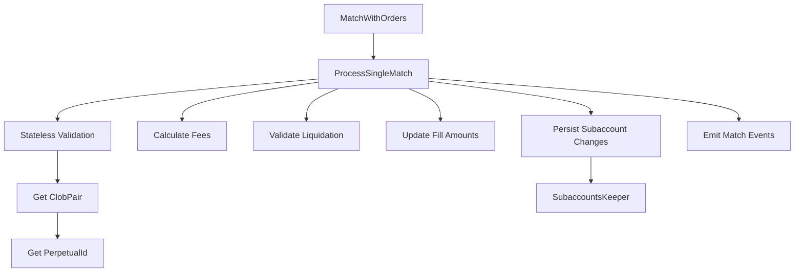

## 3. State Management Relationships

### 3.1. Persistent State Components

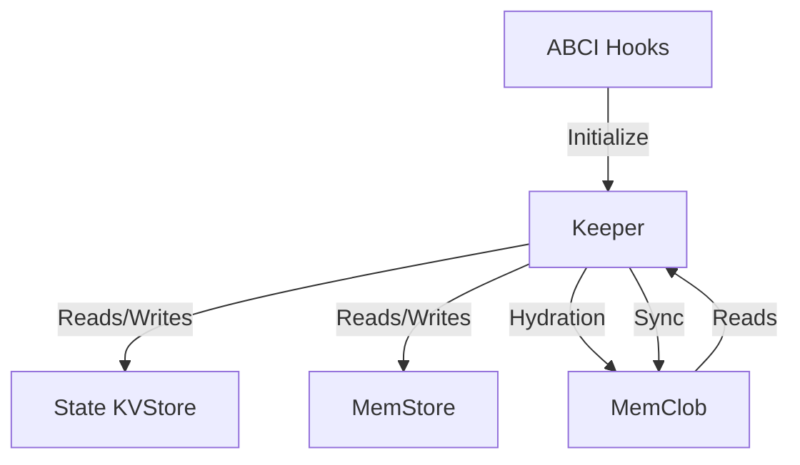

### 3.2. Order State Lifecycle

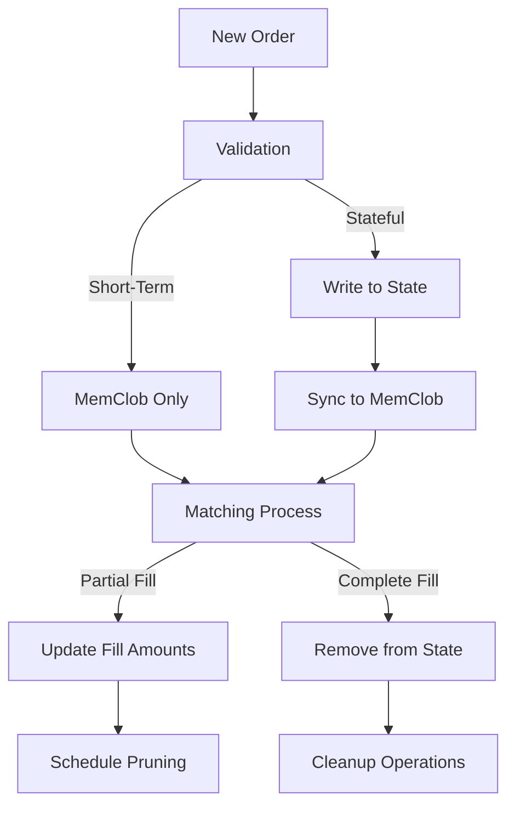

## 4. Risk Management Integration

### 4.1. Liquidation System Flow

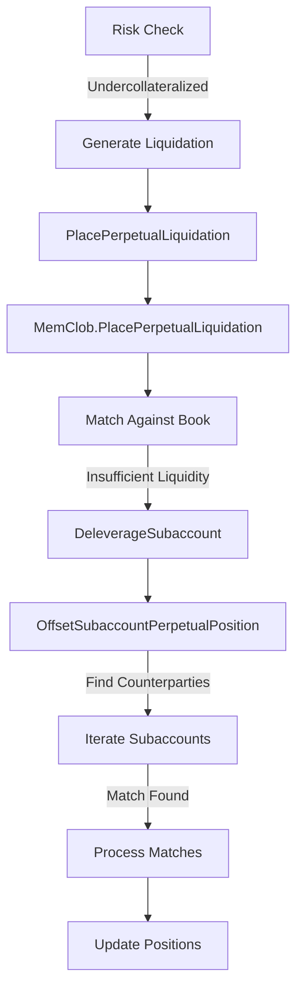

### 4.2. Deleveraging Dependencies

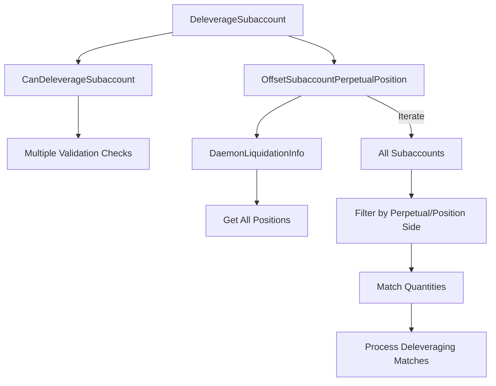

## 5. External Module Dependencies

### 5.1. Subaccounts Module Integration

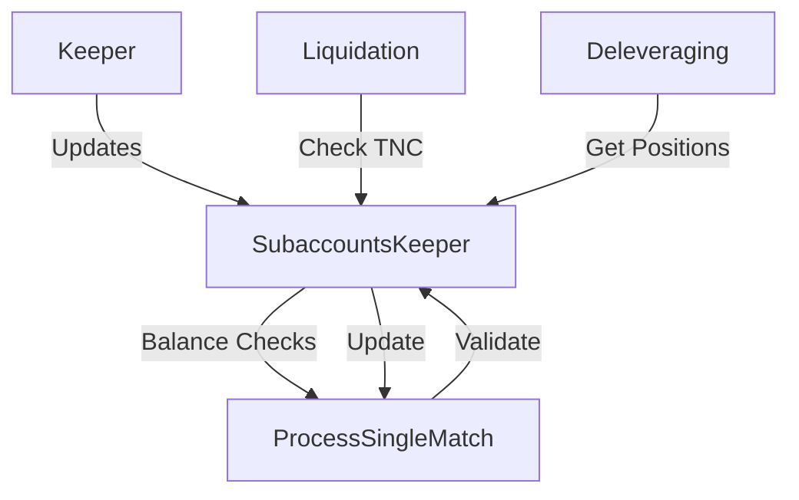

### 5.2. Perpetuals Module Integration

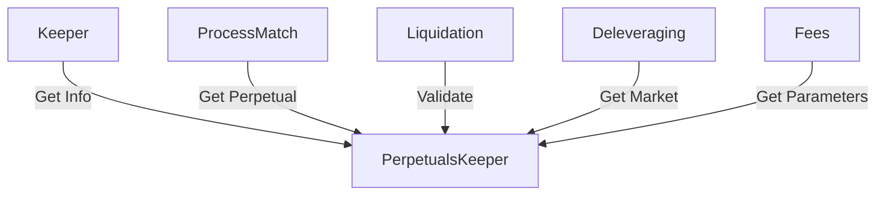

### 5.3. Prices Module Integration

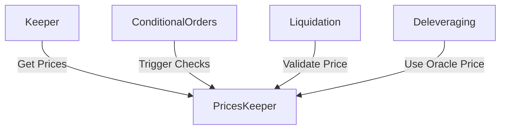

## 6. ABCI Lifecycle Integration

### 6.1. Block Processing Dependencies

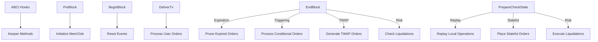

### 6.2. Operations Queue Management

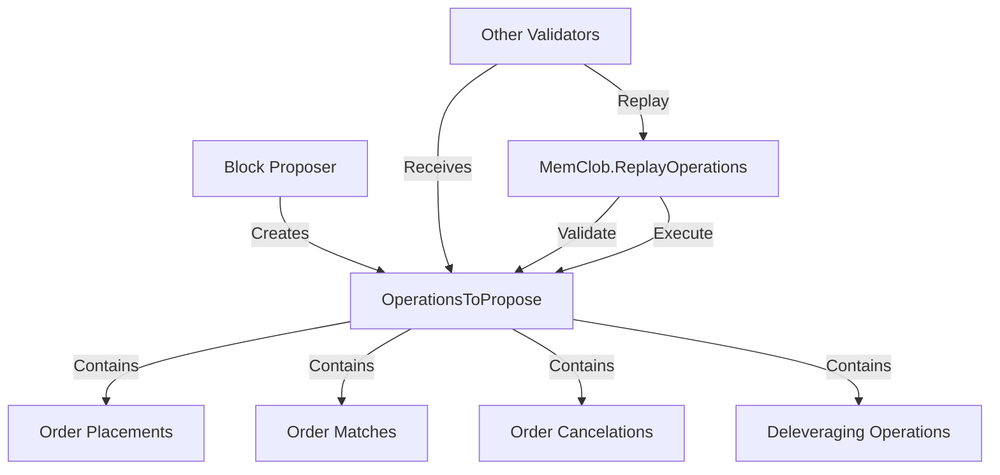

## 7. Streaming and Indexing Integration

### 7.1. Event Generation Flow

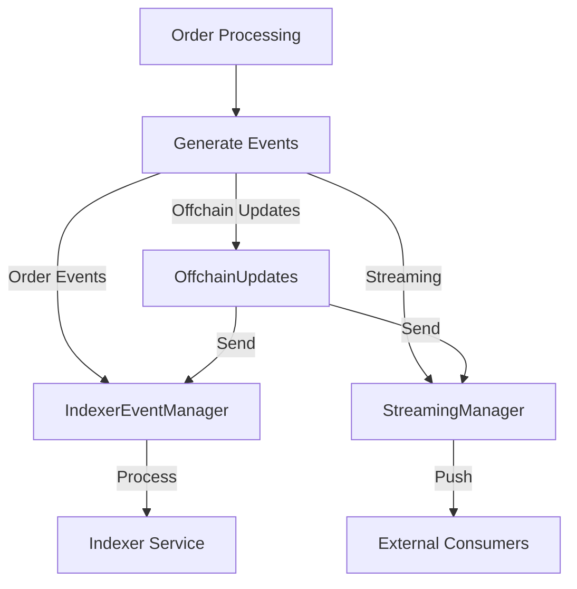

### 7.2. Off-Chain Update Generation

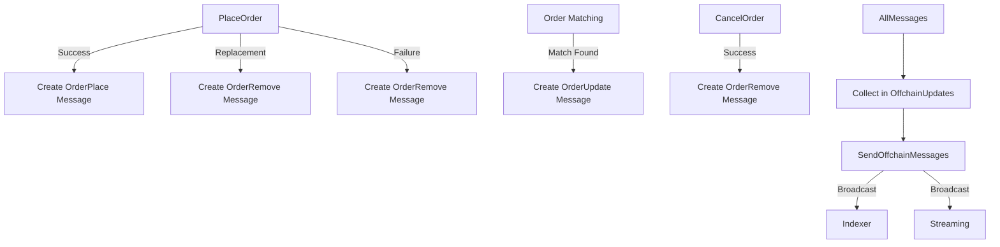

## 8. Error Handling and Recovery

### 8.1. Validation Error Propagation

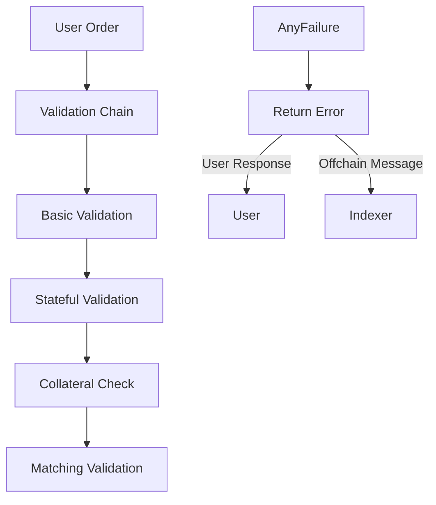

### 8.2. State Recovery Mechanisms

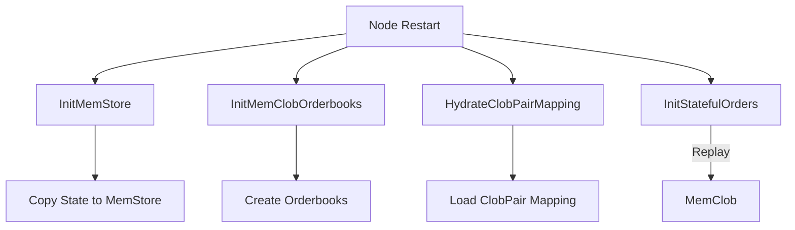

These component relationships illustrate the complex interactions within the CLOB module and how it integrates with other parts of the protocol to provide a complete decentralized order book system.
