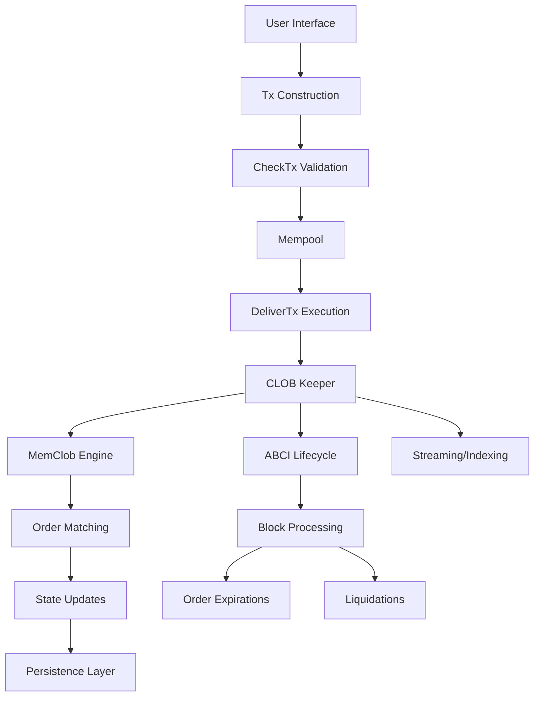
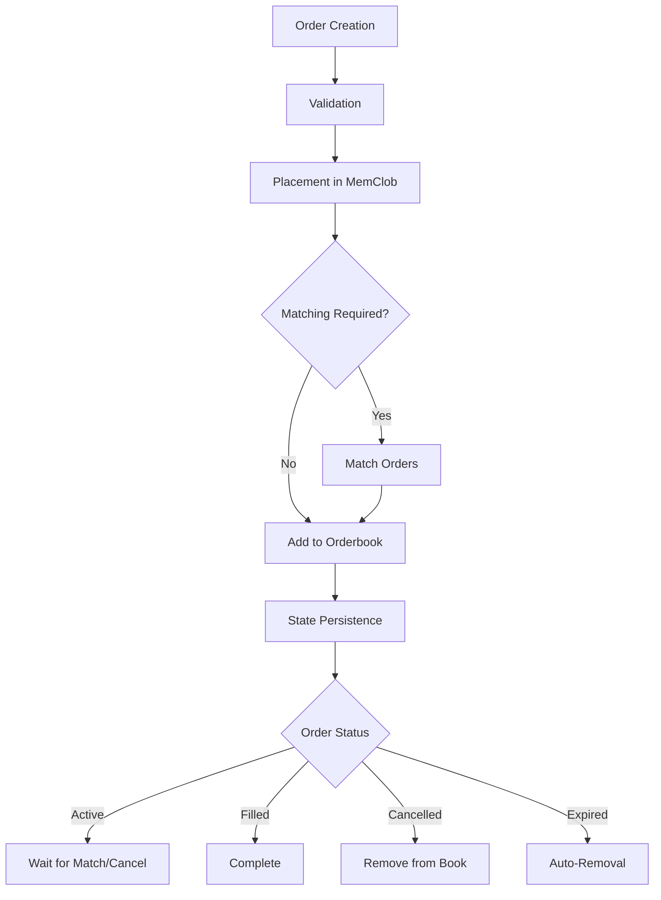
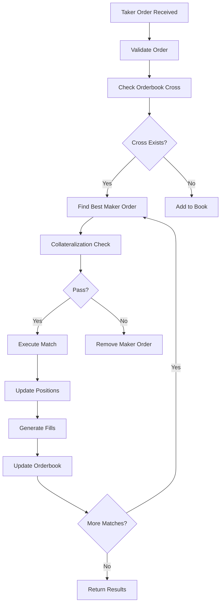
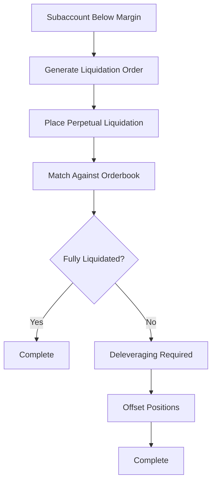

# CLOB Module Learning Path

This document outlines a comprehensive learning path for understanding the CLOB (Central Limit Order Book) module in the dYdX v4 protocol chain. The path is structured to progress from basic concepts to advanced functionality, ensuring a solid foundation before diving into complex implementations.

## 1. Foundational Concepts

### 1.1. Basic Order Book Mechanics

- Understand the fundamental principles of central limit order books
- Learn about price-time priority matching
- Study bid-ask spreads and market depth
- Explore order types: market, limit, stop-loss, take-profit

### 1.2. Perpetual Trading Basics

- Learn about perpetual contracts and how they differ from traditional futures
- Understand funding rates and their role in perpetual markets
- Study leverage mechanics and margin requirements
- Explore liquidation processes and risk management

### 1.3. Blockchain Context

- Understand how order books operate in a blockchain environment
- Learn about consensus mechanisms and their impact on order processing
- Study the difference between on-chain and off-chain order management

## 2. CLOB Module Architecture Overview

### 2.1. High-Level Architecture

### 2.2. Core Components

- **Keeper**: Main interface for interacting with the CLOB module
- **MemClob**: In-memory order book implementation for fast matching
- **Orderbook**: Data structures for managing buy/sell orders
- **Matching Engine**: Logic for matching taker and maker orders
- **State Management**: Persistent storage of orders and fills

### 2.3. Key Data Structures

- `Order`: Represents a trading order with all its attributes
- `OrderId`: Unique identifier for orders with different flag types
- `Orderbook`: Price-time priority data structure for orders
- `Level`: Price level containing orders at the same price
- `LevelOrder`: Individual order within a price level

## 3. Order Management System

### 3.1. Order Types and Classifications

#### 3.1.1. By Duration

- **Short-Term Orders**: Exist only in mempool/mempool blocks
- **Stateful Orders**: Persisted in state (Long-Term and Conditional)
- **Conditional Orders**: Trigger-based orders (Stop-Loss, Take-Profit)
- **TWAP Orders**: Time-weighted average price orders

#### 3.1.2. By Behavior

- **Limit Orders**: Specify price and quantity
- **Market Orders**: Execute immediately at best available price
- **Reduce-Only Orders**: Only reduce existing positions
- **Post-Only Orders**: Only add liquidity, cancel if would match
- **IOC/FOK Orders**: Immediate-or-Cancel/Fill-or-Kill execution

### 3.2. Order Lifecycle

### 3.3. Order Validation Process

- Stateless validation (basic format checks)
- Stateful validation (margin, leverage, equity tier limits)
- Collateralization checks
- Rate limiting and circuit breaker checks

## 4. Matching Engine Deep Dive

### 4.1. Price-Time Priority Algorithm

- Understanding subticks and price granularity
- Time priority implementation using linked lists
- Best bid/best ask tracking and updates
- Cross-book matching logic

### 4.2. Matching Process Flow

### 4.3. Collateralization Checks

- Subaccount balance verification
- Position size validation
- Margin requirement calculations
- Handling undercollateralized orders

## 5. Risk Management Systems

### 5.1. Liquidation Mechanisms

#### 5.1.1. Liquidation Triggers

- Maintenance margin requirements
- Automatic liquidation thresholds
- Liquidation price calculations

#### 5.1.2. Liquidation Process

### 5.2. Deleveraging System

- Negative TNC (Total Net Collateral) handling
- Position offsetting across subaccounts
- Bankruptcy price vs. Oracle price deleveraging
- Final settlement procedures

### 5.3. Equity Tier Limits

- Position size restrictions based on equity
- Order count limitations
- Risk-based tier assignments

## 6. State Management and Persistence

### 6.1. In-Memory vs. Persistent State

- MemClob for fast matching operations
- KVStore for persistent order storage
- State synchronization mechanisms

### 6.2. Order Expiration Handling

- Short-term order expiration (block-based)
- Stateful order expiration (time-based)
- Pruning mechanisms for old data

### 6.3. Fill Tracking and Pruning

- Fill amount tracking for partial fills
- Prunable block height calculations
- Cleanup procedures for old fill data

## 7. ABCI Lifecycle Integration

### 7.1. Block Processing Phases

#### 7.1.1. PreBlock

- MemClob initialization
- State hydration for restart scenarios

#### 7.1.2. BeginBlock

- Event clearing and preparation

#### 7.1.3. DeliverTx

- User order processing
- Matching and state updates

#### 7.1.4. EndBlock

- Order expiration processing
- Conditional order triggering
- TWAP order generation
- Liquidation checks

#### 7.1.5. PrepareCheckState

- Local operation replay
- Stateful order placement
- Liquidation and deleveraging execution

### 7.2. Consensus and Validator Coordination

- Operations queue management
- Proposal validation
- State reconciliation mechanisms

## 8. Advanced Features and Optimizations

### 8.1. Streaming and Indexing

- Real-time orderbook updates
- Match event broadcasting
- External consumer integration

### 8.2. Performance Optimizations

- Efficient data structures for order management
- Batch processing techniques
- Memory usage optimization

### 8.3. MEV (Maximal Extractable Value) Considerations

- Orderbook fairness mechanisms
- Priority ordering considerations
- Anti-manipulation measures

## 9. Testing and Validation

### 9.1. Unit Testing Framework

- Order placement and matching tests
- Edge case validation
- Error condition handling

### 9.2. Integration Testing

- End-to-end order flow validation
- Cross-module interaction testing
- Performance benchmarking

### 9.3. Simulation and Stress Testing

- High-volume order processing
- Concurrent order scenarios
- Recovery from failure states

## 10. Monitoring and Observability

### 10.1. Metrics Collection

- Order placement rates
- Match execution statistics
- Latency measurements
- Error rate tracking

### 10.2. Logging and Debugging

- Structured logging for order events
- Debugging tools for matching issues
- Performance profiling capabilities

## Learning Progression Recommendations

### Phase 1: Foundation (Weeks 1-2)

1. Study basic order book mechanics and perpetual trading
2. Understand the CLOB module's role in the overall protocol
3. Review key data structures and their relationships
4. Complete basic tutorials on order placement and cancellation

### Phase 2: Core Implementation (Weeks 3-4)

1. Deep dive into the MemClob implementation
2. Study the matching engine algorithms
3. Understand order lifecycle management
4. Practice with simple matching scenarios

### Phase 3: Risk Management (Weeks 5-6)

1. Learn liquidation mechanisms and implementation
2. Study deleveraging processes and edge cases
3. Understand collateralization checks and margin requirements
4. Practice with risk scenario simulations

### Phase 4: Advanced Topics (Weeks 7-8)

1. Explore ABCI lifecycle integration
2. Study performance optimizations and streaming
3. Understand testing frameworks and validation approaches
4. Review monitoring and observability systems

## Key Files to Study

### Essential Reading

- `x/clob/memclob/memclob.go`: Core matching engine implementation
- `x/clob/keeper/keeper.go`: Main keeper interface and state management
- `x/clob/keeper/process_single_match.go`: Match processing logic
- `x/clob/types/order.go`: Order data structures and interfaces
- `x/clob/types/orderbook.go`: Orderbook data structures

### Advanced Topics

- `x/clob/keeper/liquidations.go`: Liquidation implementation
- `x/clob/keeper/deleveraging.go`: Deleveraging mechanisms
- `x/clob/abci.go`: Block lifecycle integration
- `x/clob/memclob/orderbook.go`: Orderbook data structure management

## Practical Exercises

1. **Order Placement Simulation**: Implement a simple order book and practice placing different order types
2. **Matching Algorithm Practice**: Build a basic matching engine that implements price-time priority
3. **Liquidation Scenario Analysis**: Create scenarios where subaccounts become undercollateralized and trace the liquidation process
4. **Performance Testing**: Measure the impact of different order volumes on matching performance
5. **Edge Case Exploration**: Identify and test unusual scenarios like self-trading, zero-quantity orders, etc.

This learning path provides a structured approach to understanding the CLOB module, progressing from basic concepts to advanced functionality while highlighting the relationships between different components of the system.
