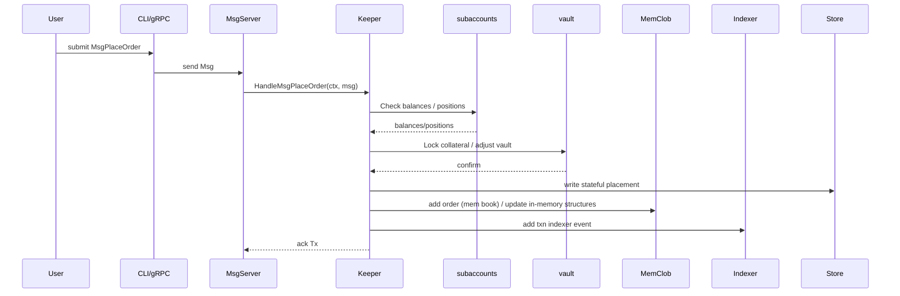
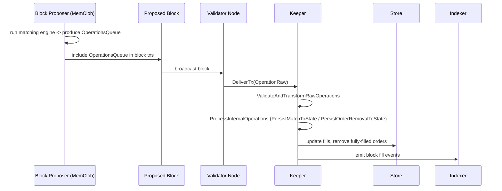

# CLOB Module — Mermaid Diagrams

Below are several Mermaid diagrams that illustrate the `clob` module's architecture, message flows, proposer operations, and ABCI lifecycle interactions with other keepers.

## Component Diagram

```mermaid
flowchart LR
  subgraph Client
    U[User / CLI / gRPC]
  end

  subgraph Node
    Msg[MsgServer]
    Keeper[Keeper]
    MemClob[MemClob (in-memory orderbooks & matcher)]
    Store[(KV Store)]
    Stream[FullNodeStreaming]
    Indexer[IndexerManager]
  end

  subgraph OtherKeepers
    Subaccounts[subaccounts]
    Vault[vault]
    Prices[prices]
    Perps[perpetuals]
    Fees[feetiers]
    Aff[affiliates]
    Rev[revshare]
    Rewards[rewards]
    Stats[stats]
  end

  U -->|Tx MsgPlaceOrder| Msg
  Msg -->|Handle -> Keeper| Keeper
  Keeper -->|persist state| Store
  Keeper -->|hydrate/update| MemClob
  Keeper -->|stream updates| Stream
  Keeper -->|events| Indexer

  Keeper --> Subaccounts
  Keeper --> Vault
  Keeper --> Prices
  Keeper --> Perps
  Keeper --> Fees
  Keeper --> Aff
  Keeper --> Rev
  Keeper --> Rewards
  Keeper --> Stats

  MemClob -->|proposer ops| Keeper
  MemClob -->|offchain snapshots| Stream
```

## PlaceOrder Sequence (simplified)



## Proposer Operations Flow



## ABCI Lifecycle Flow (CLOB-focused)

```mermaid
flowchart TD
  PreBlock[PreBlocker]
  BeginBlock[BeginBlocker]
  Deliver[DeliverTx (Msgs + ProposerOps)]
  EndBlock[EndBlocker]
  PrepareCheck[PrepareCheckState]
  Precommit[Precommit]
  Commit[Commit]

  PreBlock --> BeginBlock --> Deliver --> EndBlock --> PrepareCheck --> Precommit --> Commit

  subgraph notes
    note1[PreBlock: initialize memclob in-memory structures]
    note2[BeginBlock: reset ProcessProposerMatchesEvents, delivered order ids]
    note3[DeliverTx: Msg handlers (PlaceOrder) and proposer op processing (ProcessProposerOperations)]
    note4[EndBlock: expire orders, trigger conditional/TWAP suborders, stage finalize events]
    note5[PrepareCheckState: purge invalid mem state, place stateful orders, replay local ops, run liquidations/deleveraging]
    note6[Precommit: apply staged finalize-block side-effects, batch stream updates]
  end

  PreBlock --> note1
  BeginBlock --> note2
  Deliver --> note3
  EndBlock --> note4
  PrepareCheck --> note5
  Precommit --> note6
```

## Interactions Summary (short)

- `Keeper` validates and persists state, delegates high-throughput matching to `MemClob`.
- `MemClob` produces a deterministic operations queue for the proposer; operations are persisted by `Keeper` during DeliverTx on validators.
- Cross-keeper interactions: `subaccounts`, `vault`, `prices`, `perpetuals`, `feetiers`, `affiliates`, `revshare`, `rewards`, `stats`.

---

If you'd like, I can also generate a PlantUML sequence diagram, or export these Mermaid diagrams as standalone SVGs. Which format do you prefer? 
